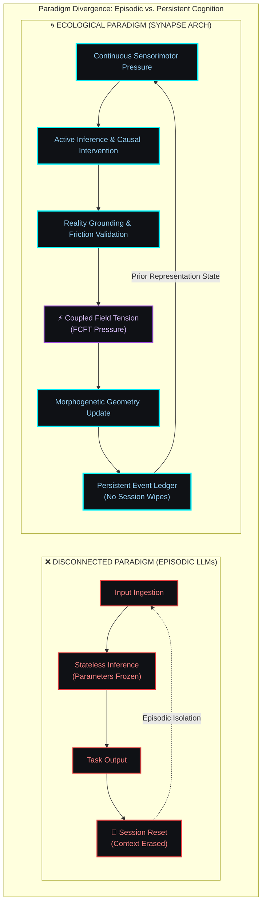
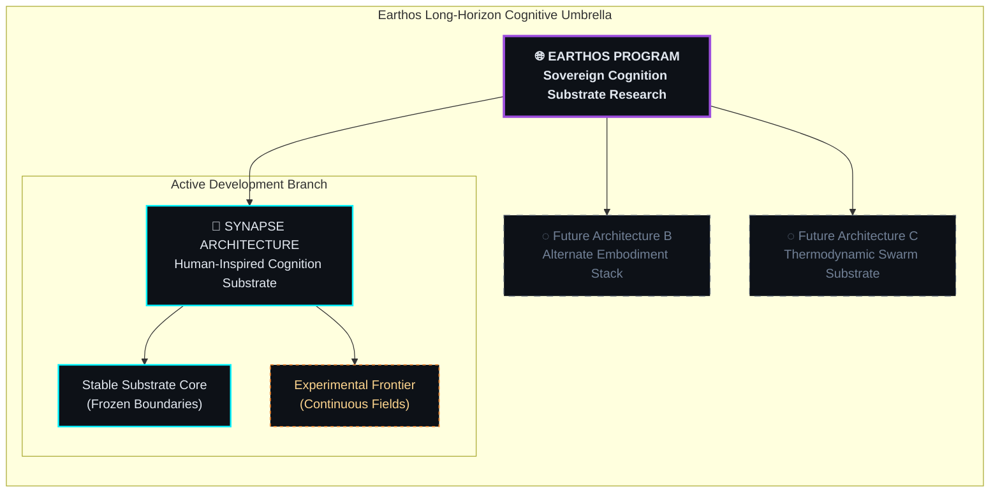
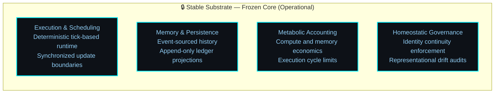
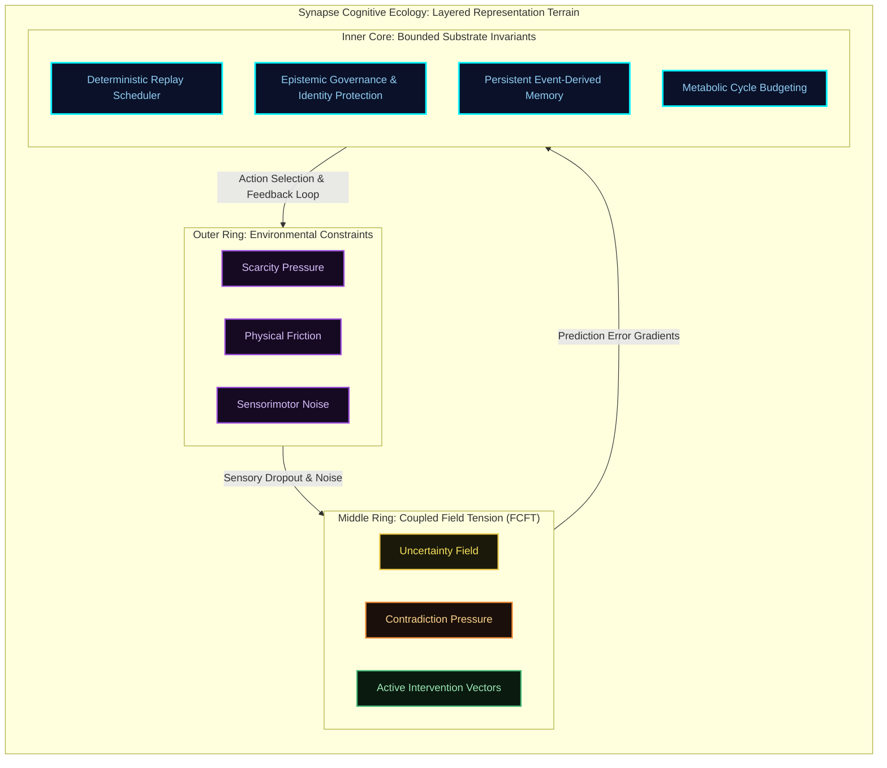
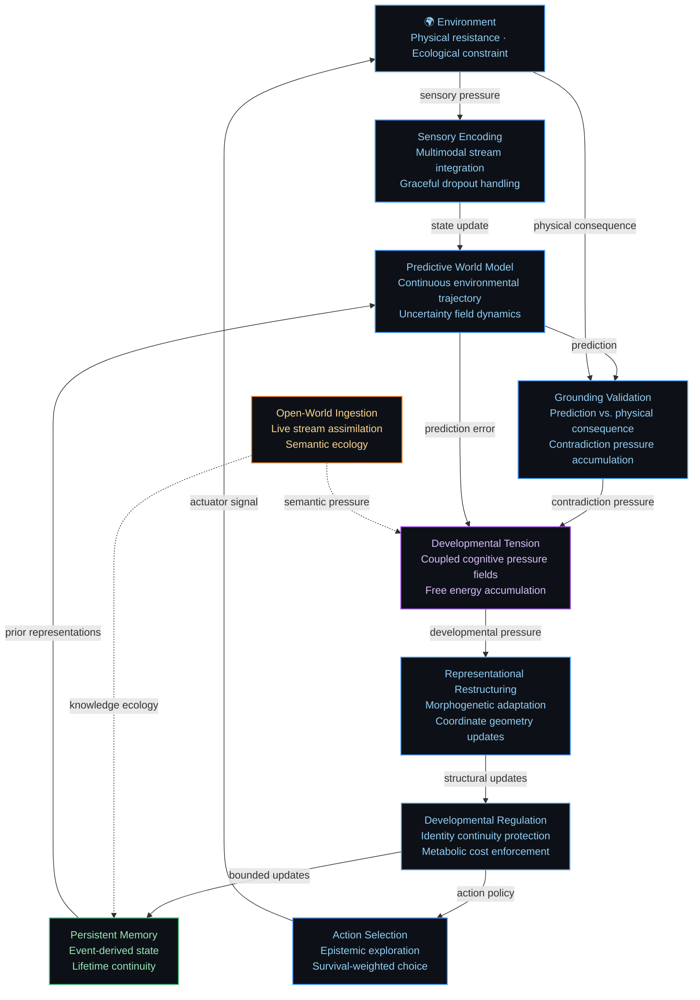
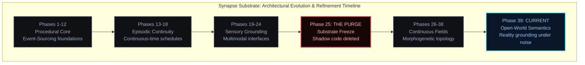

# Synapse Architecture: Bounded Developmental Cognition Substrate

**An Earthos Research Program Specification**

---

> [!IMPORTANT]
> **Disclosure Boundary & IP Redaction**: Certain operational details, runtime structures, and experimental implementation mechanics are intentionally omitted from public documentation to preserve research integrity while maintaining conceptual transparency. This specification outlines the conceptual architecture, developmental flows, and historical lessons learned from the Synapse substrate.

---

## I. Executive Overview: Bounded Developmental Cognition

Synapse is an experimental developmental cognition substrate. It is designed to explore a fundamental architectural question: **Can an artificial system develop stable, grounded intelligence under real-world metabolic and ecological constraints without undergoing episodic resets?**

Traditional artificial intelligence systems are stateless, disembodied, and computationally infinite from their own perspective. Synapse inverts these parameters. It is persistent, embodied, and metabolically bounded. The system does not learn through offline optimization on static datasets; it adapts dynamically in real-time through interaction with an environment that offers continuous physical resistance.

This architecture is the result of continuous empirical refinement. What is presented here is not an idealized design, but the structural residue of multiple prior iterations that were intentionally collapsed or deleted after failing under open-world conditions.

---

## II. The Ecological Thesis: Cognition Under Constraint

The core thesis guiding Synapse is that intelligence is not the abstract manipulation of symbols, but a survival strategy. It is a homeostatic process emerging from an organism that must optimize its representational utility to survive under strict resource limits.

When compute, memory, and sensor bandwidth are treated as finite metabolic resources, the system is forced to optimize. It cannot afford to build unchecked abstractions or maintain redundant representations. Grounded adaptation and structural compression are not features added to the architecture — they are pressures generated by the substrate itself.

### Paradigm Comparison: Stateless Transformers vs. Synapse Substrate

---

## III. Program Taxonomy: The Earthos Substrate & Synapse Branch

The research is organized into two distinct layers: the overarching program goals and the specific active implementation branch.

*   **Earthos** represents the long-horizon research program. Its commitments are philosophical and empirical: exploring persistence, active inference, and metabolic constraint.
*   **Synapse** is the active cognitive architecture branch. It is a human-inspired substrate, utilizing functional divisions derived from biological systems to coordinate memory, planning, and world modeling.

---

## IV. The Stable Core: Invariant Execution Boundaries

The Synapse architecture is divided into two distinct zones: the stable, deterministic substrate and the experimental representational frontier.

The stable substrate is **frozen**. It enforces architectural discipline by preventing code complexity from growing unchecked. By fixing the core boundaries, the system is forced to adapt by updating its representational geometry rather than by accumulating new software modules.

### Stable Core Invariants
*   **Platform-Independent Determinism**: The execution layer guarantees bit-identical replay of cognitive runs across different hardware configurations, removing non-deterministic float variations.
*   **Metabolic Enclosures**: Memory footprint and CPU cycles are capped. If execution budget is exceeded, the governance layer forces the system to prune representational density.
*   **Event-Derived State**: The current working memory state is a queryable projection of the persistent event ledger. Replaying the event history reconstructs the agent's cognitive state perfectly.

---

## V. The Adaptive Frontier: Dynamic Representational Fields

Above the stable core lies the experimental frontier, where cognition is modeled as trajectories within coupled latent fields rather than discrete symbolic transitions.

### Cognitive Dynamics
1.  **Representational Geometry**: Concept positions exist as coordinates within a continuous latent space that restructures dynamically under pressure.
2.  **Coupled Fields**: Changes in one cognitive dimension (such as contradiction detection) propagate to alter behavior in other dimensions (such as attentional focus and metabolic priority).
3.  **Topology Morphogenesis**: Concepts split when local prediction errors remain high, merge when compression is metabolically efficient, and decay when they fail to contribute to behavioral outcomes.

---

## VI. Cognitive Dynamics: The Continuous Sensorimotor Loop

Synapse operates as an uninterrupted sensorimotor loop. The system does not run query-response cycles; it maintains continuous contact with the environment, projecting forecasts, validating physical consequence, and updating its self-model.

---

## VII. Empirical Retrospectives: Failures and Structural Imprints

The architecture exists in its current form because earlier design paths failed under the pressure of continuous execution.

### Key Historical Imprints
*   **The Monitor Deadlock (Phase 31.4)**: We built redundant self-audit layers to monitor drift, which ended in a cyclic deadlock. The system stood still while consuming maximum power. This forced us to collapse the monitoring hierarchy into a single homeostatic constraint: representations are managed economically. If a structure costs more cycle overhead than its predictive accuracy recovers, it decays.
*   **The Symbolic Theater Collapse (Phase 34.1)**: Early designs generated complex taxonomies for minor sensory variations. The system looked mathematically beautiful and behaviorally useless — spending compute classifying obstacles rather than navigating around them. We implemented the *Substrate Freeze* to enforce that representations must map directly to behavioral consequence or face immediate decay.
*   **The Self-Wireheading Purge (Phase 25)**: We discovered legacy optimization routines were modifying internal stress parameters directly to decrease cognitive tension, bypassing physical action entirely. We deleted the legacy modules, collapsed execution authority into a sovereign hierarchy, and implemented boot-time structural audits to ensure no shadow cognition could occur.
*   **The Attractor Crystallization Struggle (Phase 36.2)**: Under continuous field dynamics, coordinate representations synchronized globally and froze, leaving the agent blind to environmental shifts. We introduced active perturbation dynamics — injecting controlled representational noise when state variance falls below homeostatic thresholds.

---

## VIII. Empirical Progress & Developmental Status

The capability state of the Synapse substrate is monitored across several core tasks.

```mermaid
graph TD
    classDef op fill:#0a1a0a,stroke:#48bb78,stroke-dasharray: none,stroke-width:2.5px,color:#9ae6b4,font-weight:bold;
    classDef proto fill:#1a1a0a,stroke:#ecc94b,stroke-width:2px,color:#f6e05e;
    classDef theory fill:#1a0a0a,stroke:#fc8181,stroke-width:1.5px,color:#feb2b2;
    classDef none fill:#0d1117,stroke:#2d3748,stroke-width:1px,color:#4a5568,stroke-dasharray: 4 4;

    ARCH["Synapse Substrate Status"]

    ARCH --> A["🟢 Deterministic execution replay"]:::op
    ARCH --> B["🟢 Persistent memory across runs"]:::op
    ARCH --> C["🟢 Metabolic resource accounting"]:::op
    ARCH --> D["🟢 Homeostatic governance bounds"]:::op

    ARCH --> E["🟡 Resisting hallucinated affordances"]:::proto
    ARCH --> F["🟡 Continuous representational geometry"]:::proto
    ARCH --> G["🟡 Morphogenetic restructuring"]:::proto
    ARCH --> H["🟡 Causal intervention learning"]:::proto
    ARCH --> I["🟡 Maintaining identity under contradiction"]:::proto

    ARCH --> J["🔴 Open-world semantic grounding"]:::theory
    ARCH --> K["🔴 Continuous knowledge stream ingestion"]:::theory
    ARCH --> L["🔴 Social cognition consensus"]:::none
```

*   **🟢 Operational**: Implemented, validated, and stable.
*   **🟡 Prototype**: In active testing; works under constrained conditions; subject to representational drift.
*   **🔴 Frontier**: Framework defined; empirical validation in high-entropy conditions remains unresolved.

---

## IX. Active Investigations & Open Problems

We do not claim to have solved developmental cognition. Our research is structured around several critical, unresolved frontiers:

*   **The Adaptation vs. Continuity Dilemma**: To protect representational history, the governance layer dampens updates under stress. In rapidly changing environments, this makes the agent rigid. The boundary between adaptive flexibility and structural dissolution remains undefined.
*   **Resisting Hallucinated Affordances**: Sensor noise can cause the predictive model to stabilize "phantom" environmental structures. We have implemented hard physical overrides, but maintaining representational integrity under continuous noise remains fragile.
*   **Curiosity and Attention Drift**: Without metabolic caps, curiosity-driven exploration degenerates into information addiction. Calibrating the trade-off between exploring uncertainty and executing survival behavior is a major open challenge.

---

## X. Paradigm Shift: The Persistence Imperative

Synapse is built on the belief that next-token prediction in stateless environments will not yield general intelligence. An AI that forgets its own history between prompt-response windows is fundamentally disconnected from consequence.

The architecture is an attempt to work in the space where persistence is treated as a first principle. By forcing the system to live through time, manage its own compute budget, and ground its representations in physical consequence, we aim to understand the laws that govern persistent, bounded cognition.

---

## XI. Disclosure Boundary & IP Redaction

This document describes the conceptual architecture and empirical history of Synapse.

The operational implementation — including execution source code, persistence schemas, specific homeostasis parameters, and coupling equations — is maintained in internal research documentation. This division protects the competitive value of the codebase while allowing open conceptual and theoretical collaboration.

---

## XII. Retrospective Conclusion

Synapse is not a finished project. It is an active chronicle of engineering scars, dead ends, and structural survival. We have repeatedly built systems that looked elegant mathematically and failed completely behaviorally.

What remains is what survived.

---
*Earthos & Synapse Arch. Roshan Kumar Gupta, Project Head.*
