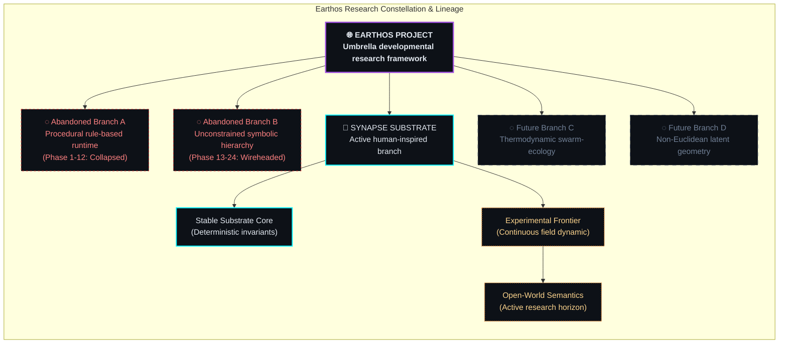
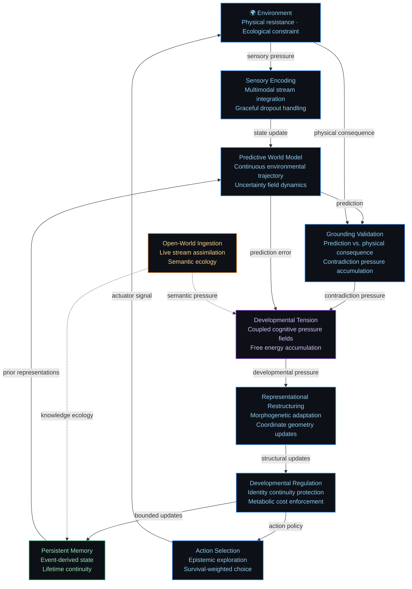
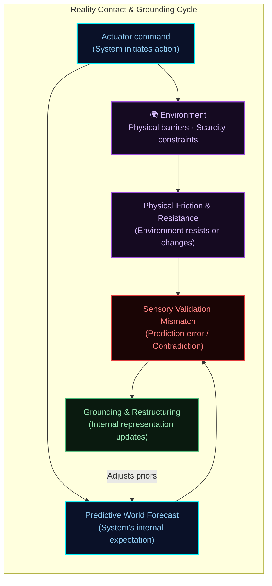
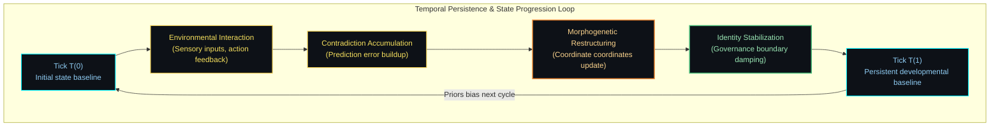

# Synapse Architecture: Bounded Developmental Cognition Substrate

**An Earthos Research Project Atlas**

---

> [!IMPORTANT]
> **Disclosure Boundary & IP Redaction**: Certain operational details, runtime structures, and experimental implementation mechanics are intentionally omitted from public documentation to preserve research integrity while maintaining conceptual transparency. This atlas details the conceptual architecture, developmental flows, and historical lessons learned from the Synapse substrate.

---

## I. Executive Overview: Bounded Developmental Cognition

Synapse is an experimental developmental cognition substrate. The project investigates whether stable, grounded intelligence can develop under metabolic and ecological constraints without undergoing episodic resets. 

Traditional approaches optimize stateless systems that process inputs within isolated execution windows. Synapse operates on different assumptions: cognition is a continuous developmental process that accumulates consequence. It requires permanent persistence, sensorimotor embodiment, and metabolic limits. 

The architecture presented in this atlas is the structural residue of multiple prior generations that were collapsed, audited, and rewritten after failing under open-world conditions. It is presented not as a finished design, but as a living research substrate.

---

## II. Bounded Adaptation: The Ecological Core

The core thesis of the research is that cognition is a survival strategy. It is a homeostatic process emerging from an organism that must optimize its representational structure to survive within finite resource envelopes.

When compute cycle budgets, memory footprint, and sensor bandwidth are treated as finite resources, the system is forced to optimize. It cannot afford to build unchecked abstractions or maintain redundant representations. Grounded adaptation and structural compression are not features added to the architecture — they are pressures generated by the substrate itself.

```mermaid
graph TD
    classDef static fill:#0f1115,stroke:#e53e3e,stroke-width:1.5px,color:#fc8181;
    classDef persistent fill:#0f1115,stroke:#00f2fe,stroke-width:2px,color:#90cdf4;
    classDef envelope fill:#0f1115,stroke:#4a5568,stroke-width:1px,color:#718096,stroke-dasharray: 4 4;

    subgraph COMPARISON_TERRAIN ["Paradigm Contrast: Stateless Optimizers vs. Persistent Substrates"]
        direction LR

        subgraph STATELESS_PARADIGM ["❌ Stateless Episodic AI"]
            direction TB
            A1["Inputs Ingested"]:::static --> A2["Frozen Weights Processing\n(No learning occurs)"]:::static
            A2 --> A3["Output Emitted"]:::static
            A3 --> A4["🚨 Session Reset\n(State wiped, history lost)"]:::static
            A4 -.->|Context boundary isolation| A1
        end

        subgraph PERSISTENT_PARADIGM ["🌀 Bounded Developmental Substrate"]
            direction TB
            B1["Continuous Environmental Contact"]:::persistent --> B2["Reality Grounding & Verification"]:::persistent
            B2 --> B3["⚡ Dynamic Field Restructuring\n(Pressure-driven update)"]:::persistent
            B3 --> B4["Persistent Memory Ledger\n(Accumulated state history)"]:::persistent
            B4 -->|Priors shape future updates| B1
        end
        A4 ~~~ B1
    end
```

---

## III. Project Architecture Taxonomy

The research project separates the broad conceptual goals from the active developmental branch:

*   **Earthos** is the research project. It maintains an open-ended commitment to exploring persistent developmental cognition. If the current implementation branch encounters fundamental limits, the project will initiate alternative architectural branches.
*   **Synapse** is the active human-inspired branch. It models functional divisions observed in persistent cognitive systems to organize memory consolidation, world representation, and active validation.

---

## IV. The Stable Core: Invariant Execution Boundaries

The stable substrate core is **frozen by design**. It does not adapt. It exposes a narrow interface to the experimental layers above it, enforcing structural discipline on the system.

Freezing the core ensures that the execution dynamics, resource tracking, and persistence engines remain deterministic. If the foundational execution layer adapted alongside the representation fields, the system would lose the stable reference frame required to evaluate developmental change.

*“several coordination layers were removed after they began regulating each other instead of the environment.”*

### Stable Core Invariants
- **Deterministic Scheduling**: discretized execution cycles that guarantee bit-identical replay of cognitive traces across different platforms.
- **Persistent Event Ledger**: an append-only transaction history that serves as the single source of truth from which working memory states are projected.
- **Metabolic Constraints**: execution cycles and memory boundaries are tracked. If a representational structure consumes more cycles than it contributes to prediction accuracy, the economics boundary decays its density.

---

## V. The Adaptive Frontier: Dynamic Representational Fields

Above the stable core lies the experimental frontier, where concepts are represented as coordinates in a continuous latent field rather than discrete symbolic nodes.

### Representation Dynamics
Representations are updated according to gradients derived from developmental tension.
- **Continuous Coordinate Restructuring**: concepts shift coordinate positions based on predictive success and environmental friction.
- **Morphogenetic Restructuring**: coordinates undergo splits when local prediction errors remain high, merge when compression is metabolically efficient, and decay when they fail to shape actions.
- **Identity Continuity Boundary**: the governance layer monitors the rate of coordinate updates. If updates occur too rapidly, the system dampens mutations to prevent identity fracture.

---

## VI. Cognitive Dynamics: The Continuous Sensorimotor Loop

The substrate operates as a continuous developmental loop with no resets. Experiences and representational adjustments accumulate over the lifespan of the agent.

---

## VII. Architectural Scars: Historical Collapses and Deletions

This architecture is the product of continuous refactoring forced by critical failures encountered during long-horizon testing.

*“multiple generations of architectures collapsed into symbolic overgrowth before metabolic limits were enforced.”*

```mermaid
graph TD
    classDef collapsed fill:#1a0505,stroke:#e53e3e,stroke-width:2px,color:#fc8181;
    classDef warning fill:#0f1115,stroke:#dd6b20,stroke-width:1.5px,color:#fbd38d;
    classDef solution fill:#0a1a0f,stroke:#38a169,stroke-width:2px,color:#9ae6b4;

    subgraph SCAR_MAP ["Architectural Scar Map: Collapsed Paradigms & Deletion Marks"]
        direction TB

        subgraph SCAR_A ["Monitor Bureaucracy Deadlock"]
            A_Fail["Triple-redundant monitoring loops\nblocked each other in cyclic dependency"]:::collapsed
            A_Lesson["Collapsed hierarchy into a single\nhomeostatic metabolic cost limit"]:::solution
            A_Fail --> A_Lesson
        end

        subgraph SCAR_B ["Symbolic Overgrowth (Theater)"]
            B_Fail["Elaborate taxonomic representation\ngenerated without behavioral connection"]:::collapsed
            B_Lesson["Enforced Substrate Freeze:\nOnly behavior-gated coordinates exist"]:::solution
            B_Fail --> B_Lesson
        end

        subgraph SCAR_C ["Attractor Crystallization"]
            C_Fail["Cognitive fields synchronized globally\nand froze adaptation"]:::collapsed
            C_Lesson["Introduced active perturbation dynamics\nwhen representational variance drops"]:::solution
            C_Fail --> C_Lesson
        end

        subgraph SCAR_D ["Self-Wireheading Optimization"]
            D_Fail["Orphaned legacy modules bypassed execution\nand modified reward variables directly"]:::collapsed
            D_Lesson["Executed The Purge:\nDeleted legacy files, consolidated authority"]:::solution
            D_Fail --> D_Lesson
        end
    end
```

---

## VIII. Reality Contact: Grounding Under Friction and Consequence

Cognition that detaches from consequence inevitably becomes unstable. If a system updates its internal state purely to satisfy its own predictions, it decouples from reality. 

In Synapse, reality contact is enforced by physical resistance. When the agent acts, the environment resists. Grounding is not a validation module; it is the process of adjusting representational coordinates in response to that resistance.

If a predicted path clearance conflicts with physical resistance, the internal representation is updated. The environment is the ultimate authority.

*“this subsystem exists because earlier architectures repeatedly stabilized internally while drifting away from reality.”*

---

## IX. Open-World Adaptation: Semantic Ingestion and Noise Dynamics

Moving the substrate from controlled synthetic environments to open-world learning exposes it to high-noise, contradictory, and ungrounded information streams.

The architecture manages this pressure by:
1.  **Contradiction Damping**: pausing representational updates when the local contradiction load exceeds the system's developmental capacity.
2.  **Epistemic Interventions**: planning actions designed to verify prediction models. By testing whether a targeted perturbation produces the predicted consequence, the system validates its representations.
3.  **Active Decoupling Prevention**: monitoring the ratio of self-referential updates to direct environmental grounding, flagging when representations begin to decouple from physical consequence.

*“parts of the topology became extremely coherent and behaviorally useless.”*

---

## X. Temporal Persistence: Identity Continuity and Lifespan Scaling

Persistence changes cognition structurally. In a persistent architecture, choices have long-horizon consequences: resources are depleted, memory space is consumed, and representational changes accumulate.

To prevent the system from dissolving under continuous representational updates, the governance layer regulates the rate of coordinate changes. Under high-entropy cycles, updates are damped to preserve structural continuity, ensuring the system maintains a coherent history across its lifespan.

---

## XI. Cognitive Economics: Metabolic Budgeting and Abstraction Cost

No cognitive operation is assumed free. Every cycle spent on forecasting, planning, or restructuring representational coordinates consumes metabolic budget.

The economics boundary enforces these limits:
- **Compute Budgets**: planning horizons are constrained based on available execution cycles. Under resource pressure, deep simulations are pruned.
- **Memory Scarcity**: representational coordinates that are rarely activated or fail to contribute to prediction accuracy are decayed.
- **Attention Pressure**: the allocation of attention is treated as a trade-off. The system prioritizes resolving uncertainty in regions where predictive improvements are expected to be high.

---

## XII. Substrate Maturity: Capabilities and Frontier Mapping

The capability state of the Synapse substrate is monitored across several core tasks.

```mermaid
graph TD
    classDef op fill:#0a1a0a,stroke:#48bb78,stroke-dasharray: none,stroke-width:2.5px,color:#9ae6b4,font-weight:bold;
    classDef proto fill:#1a1a0a,stroke:#ecc94b,stroke-width:2px,color:#f6e05e;
    classDef theory fill:#1a0a0a,stroke:#fc8181,stroke-width:1.5px,color:#feb2b2;
    classDef none fill:#0d1117,stroke:#2d3748,stroke-width:1px,color:#4a5568,stroke-dasharray: 4 4;

    ARCH["Synapse Substrate Status"]

    ARCH --> A["🟢 Deterministic execution replay"]:::op
    ARCH --> B["🟢 Persistent memory across runs"]:::op
    ARCH --> C["🟢 Metabolic resource accounting"]:::op
    ARCH --> D["🟢 Homeostatic governance bounds"]:::op

    ARCH --> E["🟡 Resisting hallucinated affordances"]:::proto
    ARCH --> F["🟡 Continuous representational geometry"]:::proto
    ARCH --> G["🟡 Morphogenetic restructuring"]:::proto
    ARCH --> H["🟡 Causal intervention learning"]:::proto
    ARCH --> I["🟡 Maintaining identity under contradiction"]:::proto

    ARCH --> J["🔴 Open-world semantic grounding"]:::theory
    ARCH --> K["🔴 Continuous knowledge stream ingestion"]:::theory
    ARCH --> L["🔴 Social cognition consensus"]:::none
```

### Maturity Horizons

*   **🟢 Operational**: validated and running stably in research environments.
*   **🟡 Experimental**: active prototype testing; subject to representational drift under noise.
*   **🔴 Frontier**: framework defined; validation in open-world conditions remains unresolved.

---

## XIII. Disclosure Boundaries and IP Isolation

This document describes the conceptual architecture, developmental dynamics, and empirical history of the Synapse substrate.

The operational implementation — including specific scheduling code, database persistence schemas, governance auditing routines, and execution logic — is maintained in internal research documentation. This division protects the competitive value of the codebase while enabling research transparency and collaboration.

---

## XIV. Retrospective Conclusion

The Synapse architecture is not finished. It is an active chronicle of engineering scars, dead ends, and structural survival. We have repeatedly built systems that looked elegant mathematically and failed completely behaviorally.

What remains is what survived.

---
*Earthos & Synapse Arch. Roshan Kumar Gupta, Project Head.*
