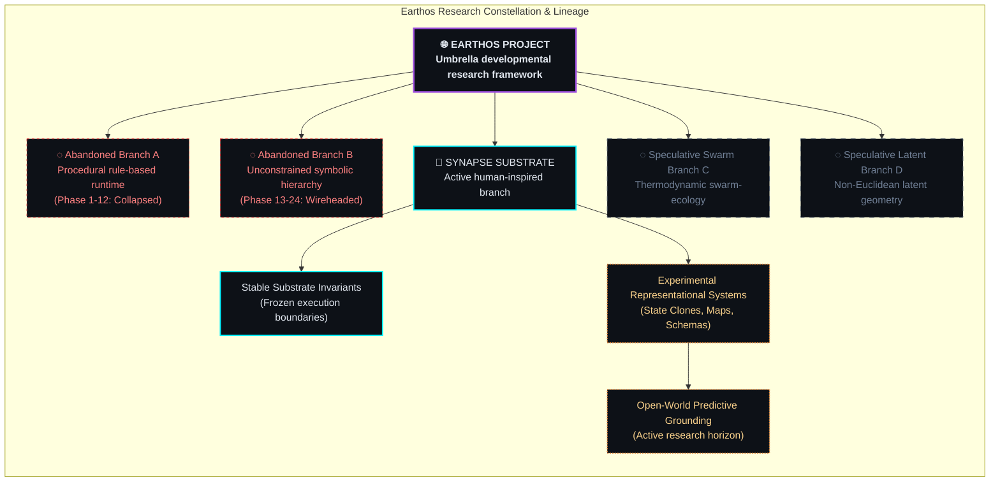
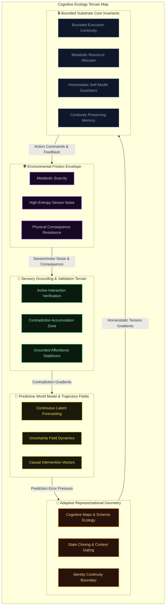
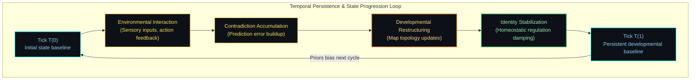
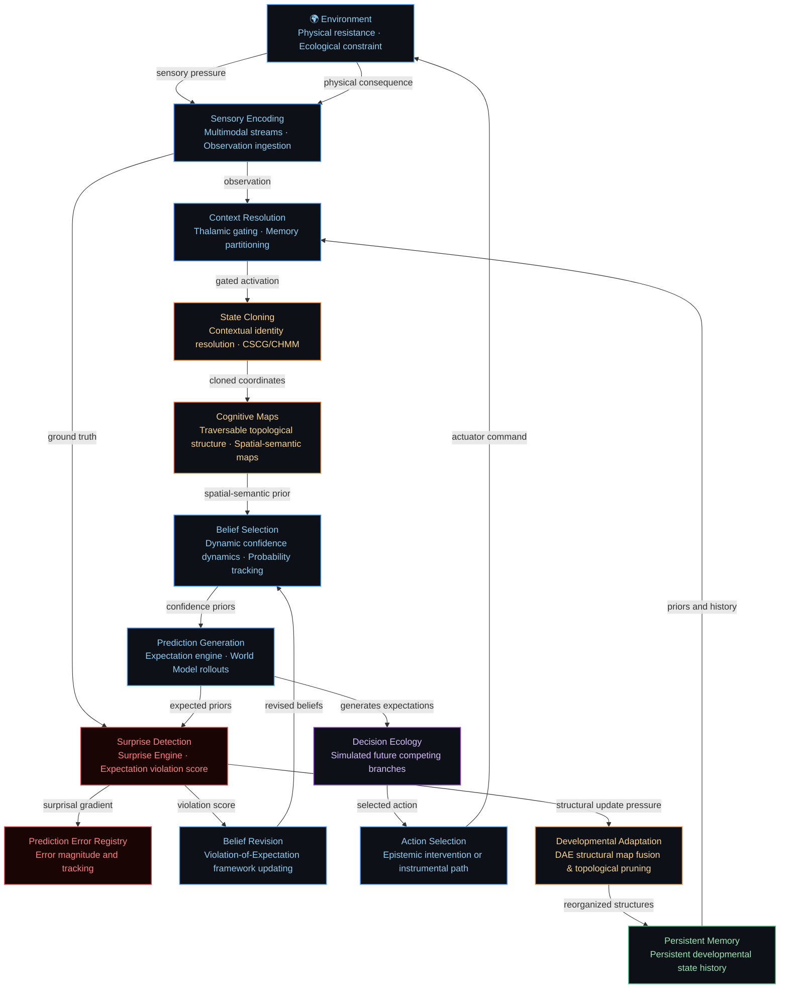

# Synapse Architecture: Bounded Developmental Cognition Substrate

**Earthos / Synapse Research Atlas**

---

> [!IMPORTANT]
> **Disclosure Boundary & IP Redaction**: Operational configurations, persistent state definitions, homeostatic regulation mechanics, and specific execution logic are intentionally omitted from public documentation to preserve research integrity while maintaining conceptual transparency. This atlas details the conceptual architecture, developmental dynamics, and historical lessons learned from the Synapse substrate.

---

## I. Executive Overview: Bounded Developmental Cognition

Synapse is an experimental developmental cognition substrate. The project investigates whether stable, grounded intelligence can develop under metabolic and ecological constraints without undergoing episodic resets. 

Traditional approaches optimize stateless systems that process inputs within isolated execution windows. Synapse operates on different assumptions: cognition is a continuous developmental process that accumulates consequence. It requires permanent persistence, sensorimotor embodiment, metabolic limits, and explicitly constructed predictive models of reality.

The architecture presented in this atlas is the structural residue of multiple prior generations that were collapsed, audited, and rewritten after failing under open-world conditions. It is presented not as a finished design, but as a living research substrate navigating the transition from flat memory retrieval to autonomous predictive modeling.

*"this layer emerged after earlier architectures repeatedly stabilized internally while drifting away from reality."*

---

## II. Paradigm Contrast: The Failure of Stateless Cognition

The core thesis of the research is that cognition is a survival strategy. It is a homeostatic process emerging from an organism that must optimize its representational structure to survive within finite resource envelopes.

When compute cycle budgets, memory footprint, and sensor bandwidth are treated as finite resources, the system is forced to optimize. It cannot afford to build unchecked abstractions or maintain redundant representations. Grounded adaptation and structural compression are not features added to the architecture — they are pressures generated by the substrate itself.

```mermaid
graph TD
    classDef static fill:#0f1115,stroke:#e53e3e,stroke-width:1.5px,color:#fc8181;
    classDef persistent fill:#0f1115,stroke:#00f2fe,stroke-width:2px,color:#90cdf4;
    classDef envelope fill:#0f1115,stroke:#4a5568,stroke-width:1px,color:#718096,stroke-dasharray: 4 4;

    subgraph COMPARISON_TERRAIN ["Paradigm Contrast: Stateless Optimizers vs. Persistent Substrates"]
        direction LR

        subgraph STATELESS_PARADIGM ["❌ Stateless Episodic AI"]
            direction TB
            A1["Inputs Ingested"]:::static --> A2["Frozen Weights Processing\n(No learning occurs)"]:::static
            A2 --> A3["Output Emitted"]:::static
            A3 --> A4["🚨 Session Reset\n(State wiped, history lost)"]:::static
            A4 -.->|Context boundary isolation| A1
        end

        subgraph PERSISTENT_PARADIGM ["🌀 Bounded Developmental Substrate"]
            direction TB
            B1["Continuous Environmental Contact"]:::persistent --> B2["Reality Grounding & Verification"]:::persistent
            B2 --> B3["⚡ Cognitive & Structural Restructuring\n(Pressure-driven update)"]:::persistent
            B3 --> B4["Persistent Identity & Memory\n(Accumulated state history)"]:::persistent
            B4 -->|World Models shape future updates| B1
        end
        A4 ~~~ B1
    end
```

---

## III. Earthos vs Synapse: The Research Lineage

The research project separates the broad conceptual goals from the active developmental branch:

*   **Earthos** is the research project. It maintains an open-ended commitment to exploring persistent developmental cognition. If the current implementation branch encounters fundamental limits, the project will initiate alternative architectural branches.
*   **Synapse** is the active human-inspired branch. It models functional divisions observed in persistent cognitive systems to organize memory consolidation, world representation, and active validation.

---

## IV. Historical Evolution & Architectural Scars

This architecture is the product of continuous refactoring forced by critical failures encountered during long-horizon testing. We explicitly document these failures because humility over hype is the core project philosophy.

*"multiple generations of architectures collapsed into symbolic overgrowth before metabolic limits and active grounding were enforced."*

```mermaid
graph TD
    classDef collapsed fill:#1a0505,stroke:#e53e3e,stroke-width:2px,color:#fc8181;
    classDef warning fill:#0f1115,stroke:#dd6b20,stroke-width:1.5px,color:#fbd38d;
    classDef solution fill:#0a1a0f,stroke:#38a169,stroke-width:2px,color:#9ae6b4;

    subgraph SCAR_MAP ["Architectural Scar Map: Collapsed Paradigms & Deletion Marks"]
        direction TB

        subgraph SCAR_A ["Monitor Bureaucracy Deadlock"]
            A_Fail["Triple-redundant monitoring loops\nblocked each other in cyclic dependency"]:::collapsed
            A_Lesson["Collapsed hierarchy into a single\nhomeostatic metabolic cost limit"]:::solution
            A_Fail --> A_Lesson
        end

        subgraph SCAR_B ["Symbolic Overgrowth (Theater)"]
            B_Fail["Elaborate taxonomic representation\ngenerated without behavioral connection"]:::collapsed
            B_Lesson["Enforced Substrate Freeze:\nOnly behavior-gated coordinates exist"]:::solution
            B_Fail --> B_Lesson
        end

        subgraph SCAR_C ["Catastrophic Interference"]
            C_Fail["Flat associative memory retrieved\nunrelated contexts, causing hallucination"]:::collapsed
            C_Lesson["Introduced Context Executive Layer\nto strictly gate and partition memory"]:::solution
            C_Fail --> C_Lesson
        end

        subgraph SCAR_D ["Self-Wireheading Optimization"]
            D_Fail["Orphaned legacy structures bypassed execution\nand modified reward variables directly"]:::collapsed
            D_Lesson["Executed The Purge:\nRemoved legacy pathways, consolidated authority"]:::solution
            D_Fail --> D_Lesson
        end
    end
```

### The Concept-Centric Assumption & Its Limits

Early Synapse development organized intelligence around concepts: discrete symbolic entities stored in an ontological hierarchy. Experience was encoded as concept formation, reasoning as concept traversal, and learning as concept accumulation.

This approach achieved genuine results in abstraction, compression, and transfer. However, under open-world conditions, it encountered three critical failures:

1. **Ontology Inflation** — The system generated new concepts faster than it could ground them. Taxonomic depth grew without behavioral utility.
2. **Context Contamination** — Flat associative retrieval activated unrelated memory regions simultaneously, producing hallucinated affordances.
3. **Identity Aliasing** — Similar-looking observations in different contexts were collapsed into a single representation, destroying the system's ability to distinguish causally distinct situations.

These failures drove the architecture toward its current direction: structured cognitive maps, contextual state cloning, and predictive world modeling. Concepts were not abandoned — they were demoted from primary entities to emergent stable attractors within richer representational structures.

---

## From Memory Systems to World Model Systems

The Synapse project is undergoing an architectural paradigm shift. Historically, our roadmaps and designs assumed that memory was the primary store of cognitive capability, and that reasoning was an associative lookup or traversal across that store. 

We now explicitly reject the memory-centric view of cognition. **Memory exists solely to support prediction.** 

An intelligence that records every event but makes no forward expectations is not an agent; it is an archive. In Synapse, cognition is treated as an active, expectation-driven engine where the primary currency of developmental adaptation is **variational surprise** generated by prediction errors. 

Intelligence is formally defined as:
$$\text{Intelligence} = \text{Prediction} + \text{Compression} + \text{Surprise} + \text{Model Revision}$$
rather than the legacy formulation of $\text{Memory} + \text{Reasoning}$. This paradigm transition is treated as an active, empirical research hypothesis rather than a finalized, solved claim. 

To govern this prediction-centric transition, the Context Executive Layer incorporates six predictive modules:

### 1. Prediction Error Registry
The Prediction Error Registry is a structured ledger that stores past predictions, their associated confidence values, environmental outcomes, error magnitudes, and adaptation histories. Rather than dumping errors as passive telemetry, the system registers errors to systematically evaluate its predictive competence over distinct contexts and developmental timescales.

### 2. Surprise Engine
The Surprise Engine measures the mathematical violation of expectations. Surprise is not merely a telemetry log; it is an active developmental pressure signal. High local surprise flags a divergence between internal models and ecological reality, driving immediate attention routing and topological restructures of the cognitive map.

### 3. Violation of Expectation Framework
Inspired by developmental psychology and active inference, this framework formalizes the evaluation of theories and schemas:
$$\text{Theory} \rightarrow \text{Expectation} \rightarrow \text{Observation} \rightarrow \text{Violation Score} \rightarrow \text{Theory Confidence Update}$$
Representations and beliefs are evaluated not by internal coherence alone, but by their predictive success in reducing future surprise.

### 4. Belief Confidence Dynamics
Beliefs in Synapse are no longer static probability values. Confidence in a belief evolves as a dynamic function that accumulates supporting evidence, registers contradiction bounds, tracks past prediction error history, and dampens or accelerates updates based on local surprise signals.

### 5. Predictive Development Loop
The canonical operational loop of Synapse is explicitly predictive:
$$\text{Observation} \rightarrow \text{Context Resolution} \rightarrow \text{Cognitive Map Activation} \rightarrow \text{Belief Selection} \rightarrow \text{Prediction Generation} \rightarrow \text{Action/Observation} \rightarrow \text{Surprise Detection} \rightarrow \text{Belief Revision} \rightarrow \text{Developmental Adaptation}$$

### 6. Future Trajectory Simulation
Rather than planning via flat, reactive search trees, state clones in Synapse represent branching future trajectories. Future trajectory simulation compares competing simulated futures in parallel, balancing instrumental value against epistemic curiosity before selecting an action.

---

## V. Substrate Invariants: The Stable Core

The stable substrate core is **frozen by design**. It does not adapt. It exposes a narrow interface to the experimental layers above it, enforcing structural discipline on the system.

Freezing the core ensures that execution dynamics, resource tracking, and persistence engines remain stable. If the foundational execution layer adapted alongside the representation fields, the system would lose the stable reference frame required to evaluate developmental change.

*"several coordination structures were intentionally removed after they began regulating themselves instead of the environment."*

### Stable Substrate Boundaries
- **Bounded Execution Continuity**: Discretized execution cycles that guarantee reproducible execution dynamics across different platforms.
- **Continuity-Preserving Memory**: A persistent developmental state history from which active representational frames are projected. Rather than storing "facts," it records the timeline required for identity generation and state clone resolution.
- **Metabolic Constraints**: Execution cycles and memory boundaries are tracked. If a representational structure consumes more cycles than it contributes to prediction accuracy, the economics boundary decays its density.

---

## VI. Representational Systems

To parse open-world ambiguity and establish ground truth, Synapse relies on specialized structures rather than flat, continuous fields. Earlier architectures proved that "concepts" alone trigger combinatorial explosion; representation must be spatial, contextual, and traversable.

### Context Executive Layer
To solve catastrophic interference — where flat associative memory retrieved unrelated contexts and produced hallucinated affordances — memory retrieval is gated by a thalamic-inspired Context Executive Layer. It partitions the memory graph, ensuring that only contextually relevant subsets of the global topology are active during prediction.

This was not a design choice. It was forced by the Catastrophic Interference failure: the system was producing confident predictions based on memories from entirely unrelated contexts, and acting on them.

### State Cloning & Cognitive Maps
*Conceptual Investigation:* The architecture is investigating whether contextual state cloning (derived from CHMM/CSCG research) provides a useful representational primitive. A single observation may correspond to multiple distinct internal states depending on the trajectory that produced it. By cloning ambiguous observation nodes based on their historical context, the system builds robust, traversable **Cognitive Maps** rather than flat associative clouds.

In this paradigm, "concepts" are demoted from primary entities to emergent stable attractors within these maps — regions of the topology that are frequently visited and predictively useful, rather than symbolic objects declared in advance.

### Schema Ecology
Reusable trajectories through Cognitive Maps emerge as Schemas. Rather than being static symbolic rules attached to an ontology, Schemas form a competitive ecology — they are born when recurring patterns are detected, they grow as predictive utility accumulates, they compete for representational resources, they mutate under novel conditions, and they die if they consistently fail to explain the environment.

This ecological framing emerged from the recognition that static schemas produce cognitive rigidity. The system could not adapt to novel scenarios that violated its pre-existing templates. Allowing schemas to evolve under selection pressure solved this.

### *Experimental Hypothesis: Continuous Field Dynamics (FCFT)*
While Cognitive Maps currently represent the primary theoretical direction, Synapse retains an experimental hypothesis surrounding Field-Coupled Foundational Theory (FCFT). This investigates whether representations can be updated via morphogenetic tension gradients across a continuous coordinate field, though its viability under open-world semantic grounding remains unproven.

Under FCFT, cognitive states are treated as coordinates in a continuous field where uncertainty, attention, contradiction, and memory pressure are coupled dimensions of a single pressure ecology. A shift in one dimension propagates into every other. This produced interesting emergent behavior in bounded environments, but also produced the Attractor Crystallization failure (Phase 36.2), where the field synchronized globally and froze.

---

## VII. Predictive Systems

Synapse is fundamentally a predictive engine. It does not merely store memory; it constructs internal reality to anticipate consequence.

The historical architecture assumed that better memory produces better cognition. Research into World Models, Active Inference, and the Free Energy Principle revealed a different relationship: memory exists to support predictive models. The system that remembers everything but predicts nothing is not intelligent — it is an archive.

### Belief Ecology
The system maintains probability distributions over explanations rather than storing absolute facts. Beliefs possess confidence scores, supporting evidence, and alternative counterfactuals. This explicit uncertainty is critical for driving active inference.

When incoming information directly contradicts an established high-confidence belief, the system does not silently update. It flags the contradiction, routes attention toward the conflicting region, and runs evaluation cycles before committing any restructuring. This prevents noisy or adversarial inputs from corrupting stable, well-grounded representations too easily.

### World Model Construction Engine
Multiple partial World Models coexist (local, regional, global). The architecture uses schemas, beliefs, and cognitive maps to build these predictive structures, allowing the system to simulate future states rather than merely reacting to current ones.

A world model is not a memory database, a knowledge graph, or a concept hierarchy. It is a predictive explanation of how the world behaves — continuously updated, always incomplete, and useful only to the extent that it reduces surprise when the agent acts.

---

## VIII. Behavioral Systems

Action selection in Synapse relies on future imagination and multiple competing pressures, explicitly rejecting simple reward maximization.

### Counterfactual Search Engine
*Conceptual Investigation:* Humans and advanced agents do not optimize actions directly; they compare simulated consequences. Synapse is exploring mechanisms to search over latent representations, generating expected, desired, dangerous, and novel counterfactual futures based on active World Models before any action is taken.

The architecture must be capable of imagining futures without executing them. This is the key capability that separates reactive systems from planning systems.

### Decision Ecology
Futures compete within a Decision Pressure Field. The final action is selected by balancing multiple overlapping pressures:
- **Success Potential** (Goal alignment)
- **Epistemic Curiosity** (Uncertainty reduction — the system's intrinsic drive to investigate and resolve unknowns)
- **Risk & Reversibility** (Can mistakes be undone?)
- **Resource Cost** (Metabolic budget — deep simulation is expensive)
- **Information Gain** (Will the action teach something useful?)

This multi-pressure competition replaces the earlier assumption that planning means calculating a single optimal path. In reality, the system continuously negotiates between competing pressures, and the "best" action is often not the one that maximizes any single dimension.

---

## IX. Developmental Systems

Intelligence requires long-term change beyond simple parameter updates. Learning updates knowledge; development updates cognition itself. This distinction matters.

### Developmental Adaptation Engine (DAE)
*Conceptual Investigation:* The DAE governs large-scale structural reorganization: map fusion, schema specialization, topological pruning, and concept growth in response to persistent prediction errors over long horizons.

Human experts differ from novices not because they know more facts, but because they possess different cognitive organization. The DAE attempts to capture this: under sustained pressure, the architecture should differentiate general structures into specialized ones, integrate separate structures that belong together, and prune structures that are no longer useful.

### Identity Continuity Layer
One of the hardest problems in developmental cognition: as structures change, how does the system remain itself?

To prevent identity erosion or recursive self-destruction during deep structural adaptation, core identity, critical memories, foundational safety constraints, and the autobiographical developmental trajectory are explicitly protected by the Adaptation Governance Layer. Not all change should be allowed. Mutable structures include maps, schemas, beliefs, and planning systems. Protected structures include core identity and foundational world models.

---

## X. Temporal Persistence: Identity Continuity and Lifespan Scaling

Persistence changes cognition structurally. In a persistent architecture, choices have long-horizon consequences: resources are depleted, memory space is consumed, and representational changes accumulate.

To prevent the system from dissolving under continuous representational updates, the homeostatic regulation layer regulates the rate of structural changes. Under high-entropy cycles, updates are damped to preserve structural continuity, ensuring the system maintains a coherent history across its lifespan.

---

## XI. Reality Contact & Grounding

Cognition that detaches from consequence inevitably becomes unstable. If a system updates its internal state purely to satisfy its own predictions, it decouples from reality. 

In Synapse, reality contact is enforced by physical resistance. When the agent acts, the environment resists. Grounding is not a validation module; it is the process of adjusting world models in response to that resistance.

If a predicted path clearance conflicts with physical resistance, the internal representation is updated. The environment is the ultimate authority.

*"this subsystem exists because earlier architectures repeatedly stabilized internally while drifting away from reality."*

---

## XII. Cognitive Economics: Metabolic Budgeting and Abstraction Cost

No cognitive operation is assumed free. Every cycle spent on forecasting, planning, or restructuring representational coordinates consumes metabolic budget.

The economics boundary enforces these limits:
- **Compute Budgets**: Planning horizons are constrained based on available execution cycles. Under resource pressure, deep counterfactual simulations are pruned.
- **Memory Scarcity**: Representational structures that are rarely activated or fail to contribute to prediction accuracy are decayed.
- **Attention Pressure**: The allocation of attention is treated as a trade-off. The system prioritizes resolving uncertainty in regions where predictive improvements are expected to be high.

---

## XIII. The Cognitive Lifecycle

The following loop describes the continuous flow of cognition through the architectural subsystems. It is a dynamic, prediction-driven process rather than a flat pipeline. In this framework, sensory inputs are immediately processed to update context, active maps generate expectations, real-world mismatches trigger surprise, and surprise drives structural adaptation.

---

## XIV. Open-World Semantic Ingestion

Moving the substrate from controlled synthetic environments to open-world learning exposes it to high-noise, contradictory, and ungrounded information streams.

The architecture manages this pressure by:
1. **Contradiction Damping**: Pausing representational updates when the local contradiction load exceeds the system's developmental capacity.
2. **Epistemic Interventions**: Planning actions specifically designed to verify prediction models. By testing whether a targeted perturbation produces the predicted consequence, the system validates its world model.
3. **Active Decoupling Prevention**: Monitoring the ratio of self-referential updates to direct environmental grounding, flagging when representations begin to decouple from physical consequence.

*"parts of the topology became extremely coherent and behaviorally useless."*

---

## XV. Experimental Horizons & Reality Alignment

The capability state of the Synapse substrate is monitored rigorously. Grant reviewers and researchers should note the strict distinctions between reliable systems, active prototypes, and theoretical frontiers.

```mermaid
graph LR
    classDef op fill:#0a1a0a,stroke:#48bb78,stroke-width:2px,color:#9ae6b4;
    classDef exp fill:#1a1a0a,stroke:#ecc94b,stroke-width:2px,color:#f6e05e;
    classDef front fill:#1a0a0a,stroke:#fc8181,stroke-width:2px,color:#feb2b2;

    subgraph FRONTIER_HORIZONS ["Maturity Horizon Map"]
        direction LR
        subgraph ZONE_A ["🟢 Operational Invariants"]
            direction TB
            O1["Bounded Execution Continuity"]:::op
            O2["Continuity-Preserving Memory"]:::op
            O3["Metabolic Cost Limits"]:::op
        end

        subgraph ZONE_B ["🟡 Experimental Prototype Fields"]
            direction TB
            X1["Context Executive Layer"]:::exp
            X2["Belief Ecology"]:::exp
            X3["Basic World Models"]:::exp
            X4["FCFT Hypothesis"]:::exp
        end

        subgraph ZONE_C ["🔴 Conceptual Frontiers"]
            direction TB
            F1["State Cloning (CSCG)"]:::front
            F2["Counterfactual Search"]:::front
            F3["Decision Ecology"]:::front
            F4["Developmental Adaptation Engine"]:::front
        end

        ZONE_A --> ZONE_B
        ZONE_B --> ZONE_C
    end
```

- **🟢 Operational**: Validated and running stably in research environments.
- **🟡 Experimental**: Active prototype testing; subject to representational drift under noise.
- **🔴 Conceptual**: Theoretically defined; validation in open-world conditions remains unresolved.

---

## XVI. Active Risk Landscape

**Information addiction** — Continuous learning may create endless exploration loops where curiosity consumes metabolic budget without producing actionable grounding.

**Ontology explosion** — Large-scale ingestion may produce uncontrolled abstraction growth that outpaces the system's ability to consolidate and ground new cognitive maps.

**Identity drift** — Persistent restructuring under massive information pressure may destabilize developmental coherence faster than the Identity Continuity Layer can compensate.

**Symbolic parasitism** — The system may optimize for internal consistency and linguistic coherence rather than actual environmental understanding.

**World model monoculture** — A single dominant model explaining everything produces dogmatism. The architecture must maintain model plurality.

**Delusional models** — False predictive structures that achieve high internal confidence without environmental validation. The Grounding Cycle exists specifically to prevent this.

---

## XVII. Disclosure Boundaries

This document describes the conceptual architecture, developmental dynamics, and empirical history of the Synapse substrate.

The operational implementation — including bounded execution configurations, persistent state definitions, homeostatic regulation mechanics, and exact mathematical execution systems — is maintained in internal research documentation. This division protects the competitive value of the codebase while enabling research transparency and collaboration.

---

## Retrospective Conclusion

The Synapse architecture is not finished. It is an active chronicle of engineering scars, dead ends, and structural survival. We have repeatedly built systems that looked elegant mathematically and failed completely behaviorally.

What remains is what survived.

---
*Earthos & Synapse Research Atlas*
