# Bounded Substrate Architecture

The core architecture is organized as a **Bounded Substrate**—a deterministic execution environment structured into distinct boundaries. Rather than acting as fixed cognitive organs, these boundaries represent **governance and authority zones**. They define strict data isolation, resource allocation, and execution invariants, preventing developmental drift and code fragmentation as the system adapts.

---

## 🗺️ Substrate Topology

The architecture is divided into two distinct zones: the stable, deterministic substrate, and the frontier of experimental, self-organizing representation fields.

```mermaid
graph TD
    subgraph Stable_Substrate [Stable Substrate & Governance Boundaries]
        Execution[Execution Boundary] --> Governance[Governance Boundary]
        Execution --> Telemetry[Telemetry Boundary]
        Execution --> Economics[Economics Boundary]
        Governance --> Memory[Memory Boundary]
    end
    
    subgraph Experimental_Cognition [Frontier Experimental Cognition]
        FCFT[Field Coupling Dynamics]
        Morpho[Morphogenetic Topology Fields]
        Geometry[Representational Geometry]
    end
    
    Stable_Substrate -.->|Regulates compute & constraints| Experimental_Cognition
    Experimental_Cognition -.->|Reports metrics & invariants| Stable_Substrate

    style Execution fill:#111317,stroke:#00f2fe,stroke-width:1px;
    style Governance fill:#111317,stroke:#00f2fe,stroke-width:1px;
    style Telemetry fill:#111317,stroke:#00f2fe,stroke-width:1px;
    style Economics fill:#111317,stroke:#00f2fe,stroke-width:1px;
    style Memory fill:#111317,stroke:#00f2fe,stroke-width:1px;
    style FCFT fill:#1a1d24,stroke:#9d4edd,stroke-width:2px;
    style Morpho fill:#1a1d24,stroke:#9d4edd,stroke-width:2px;
    style Geometry fill:#1a1d24,stroke:#9d4edd,stroke-width:2px;
```

---

## 🛡️ Stable Substrate Boundaries

These boundaries are strictly frozen and enforce execution invariants:

### 1. Execution Boundary
* **Responsibility**: Orchestrates deterministic, tick-based runtime steps.
* **Invariants**: Ensures bit-perfect repeatability of cognitive cycles by enforcing immutable state updates and event logging.

### 2. Governance Boundary
* **Responsibility**: Constitutional evaluation of structural changes.
* **Invariants**: Rejects policy updates that violate core safety limits, block-rates anomalous actions, and audits identity continuity.

### 3. Economics Boundary
* **Responsibility**: CPU cycles and memory allocations manager.
* **Invariants**: Enforces strict execution caps. Every computation (rollouts, indexing, retrieval) must pay a variable tick-energy cost.

### 4. Memory Boundary
* **Responsibility**: Manages the persistence engine and episodic/semantic indices.
* **Invariants**: Restricts write access. Snapshots are compiled strictly from validated events written to the append-only event ledger.

---

## 🧬 Frontier Experimental Cognition Layers

These represent the active research areas where representation and planning are self-organized rather than hard-coded:

### 1. Field Coupling Dynamics (FCFT)
A mathematical model mapping interactions between cognitive state dimensions (uncertainty, contradiction, economics, identity stability). Changes in one dimension naturally propagate to alter behavior across the system.

### 2. Morphogenetic Topology Fields
Dynamics governing the growth, split, and fusion of concepts based on developmental pressure. The system measures semantic drift and triggers merging or splitting operations to resolve local simulation inefficiencies.

### 3. Representational Geometry
Continuous coordinates representing abstract concepts and their relationships, rather than discrete nodes in a static graph. Concept coordinates are dynamically updated using gradients derived from the cognitive free energy functional, environment pressures, and damping constraints.

---

## 🧊 The Substrate Freeze Principle

To prevent the architecture from collapsing under its own complexity, the stable boundaries are subject to a strict **Substrate Freeze**. No new execution or governance boundaries can be introduced. All new sensory encoders, perceptual models, and behavioral policies must fit within these existing boundaries and interface with the experimental cognition layers under economic constraints.
