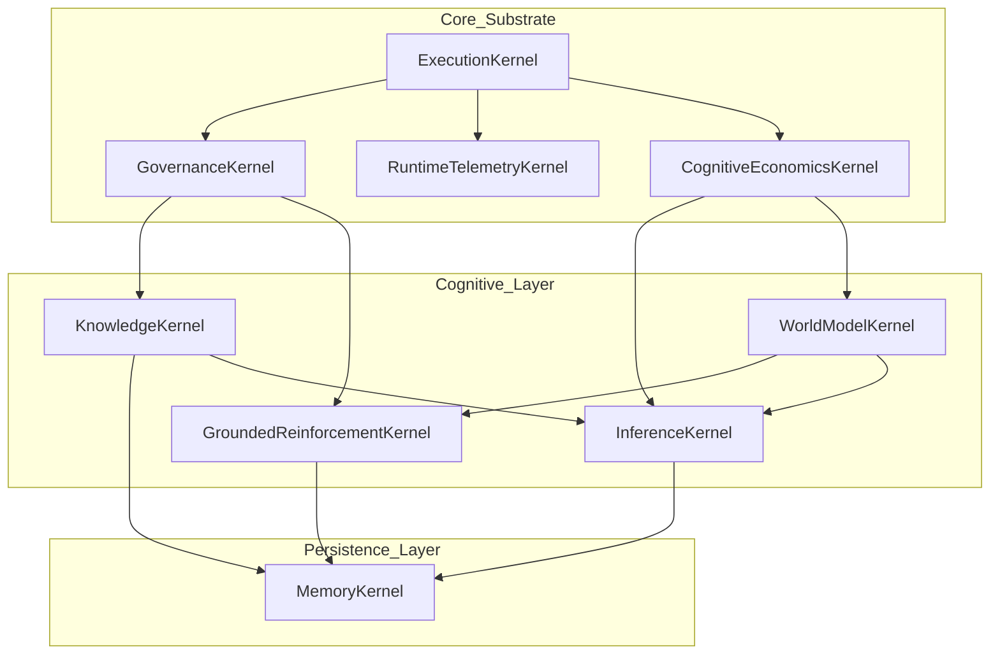

# System Architecture

Synapse Arch is structured as a **Sovereign Substrate**, a rigid hierarchy of functional kernels that together form a complete cognitive operating system. This modular yet tightly integrated approach ensures that every cognitive responsibility maps to exactly one authoritative kernel, preventing the architectural drift common in complex AI systems.

## 🗺️ Sovereign Kernel DAG

The following diagram illustrates the topological dependencies between the nine sovereign kernels.

## 🛡️ Kernel Responsibilities

### 1. ExecutionKernel
The "Heartbeat" of the system. It handles:
-   Deterministic tick-based runtime.
-   Topological scheduling of kernel operations.
-   Isolation of state mutations during cognitive cycles.

### 2. GovernanceKernel
The "Constitutional" layer. It ensures:
-   Integrity evaluation of new abstractions.
-   Approval of policy mutations.
-   Detection of cognitive drift or "wireheading" (reward hacking).

### 3. CognitiveEconomicsKernel
The "Resource Manager". It manages:
-   Allocation of CPU/Memory budget for recursive tasks.
-   Priority scoring for concurrent cognitive threads.
-   Optimization of compute vs. epistemic gain.

### 4. WorldModelKernel
The "Imagination" engine. It provides:
-   Latent space simulation of environment dynamics.
-   Counterfactual rollouts (what-if scenarios).
-   Forward prediction of sensory outcomes.

### 5. InferenceKernel
The "Reasoner". It handles:
-   Multi-hop symbolic deduction.
-   Probabilistic strategy search.
-   Conflict resolution between competing hypotheses.

### 6. KnowledgeKernel
The "Librarian". It manages:
-   The abstraction lifecycle (generalization and pruning).
-   Ontology maintenance and versioning.
-   Representation of core concepts and their relations.

### 7. GroundedReinforcementKernel
The "Learner". It performs:
-   Reality-grounded policy updates.
-   Causal credit assignment.
-   Exploration vs. exploitation management.

### 8. MemoryKernel
The "Store". It provides:
-   Epistemic persistence across sessions.
-   High-fidelity episodic retrieval.
-   Semantic knowledge indexing.

### 9. RuntimeTelemetryKernel
The "Observer". It tracks:
-   Causal lineage of every cognitive decision.
-   System-wide performance metrics.
-   Live state visualization data.

## 🧊 The Substrate Freeze Principle

To maintain structural integrity, the Synapse Arch core is subject to a **Substrate Freeze**. No new kernels can be added to the core substrate. All additional functionality (e.g., specific sensory encoders, tool adapters, or environment interfaces) must be implemented as **Policies** or **Subsystems** owned by one of the nine kernels.
