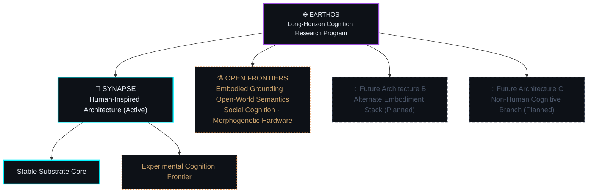
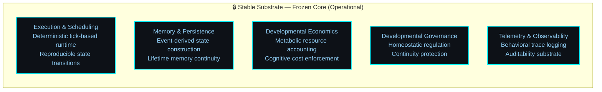
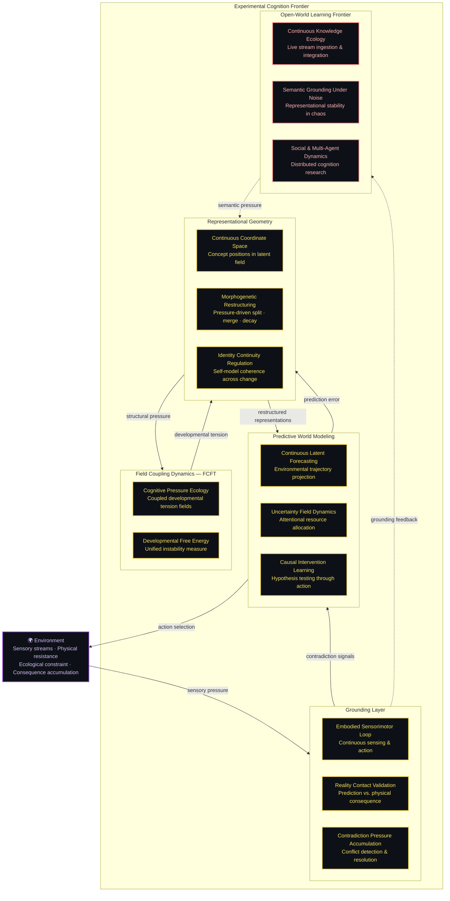
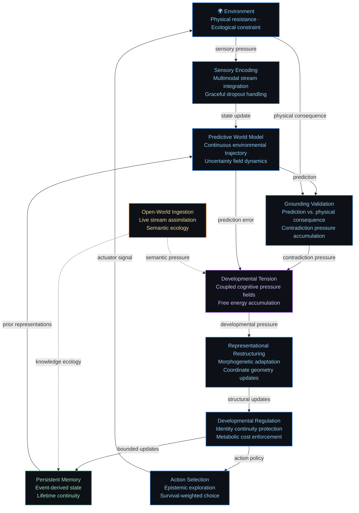

# Synapse Architecture — Developmental Cognition Substrate

**An Earthos Research Program Document**

---

> [!IMPORTANT]
> This document describes the architectural philosophy and conceptual structure of the Synapse developmental cognition substrate. Certain operational details, runtime structures, and experimental implementation mechanics are intentionally omitted from public documentation to preserve research integrity while maintaining conceptual transparency.

---

## Executive Summary

Synapse is not a language model. It is not a reasoning pipeline. It is not a wrapper around commercial AI infrastructure.

It is an experimental developmental cognition substrate — a persistent, embodied, ecologically-constrained cognitive architecture designed to explore a question that the dominant AI paradigm has largely set aside:

**Can an artificial system develop coherent, grounded intelligence over time, under real constraints, without resetting?**

The architecture presented here is the result of years of iterative failure, structural collapse, and careful reconstruction. Several major architectural versions were intentionally abandoned before this structure emerged. The diagrams in this document do not represent an idealized design — they represent what survived empirical contact with real environmental pressure.

Parts of this system exist specifically because previous versions failed catastrophically.

---

## Why This Architecture Exists

The current mainstream AI paradigm has produced remarkable systems — and a remarkable blind spot.

Scaling static transformers produces impressive performance on static benchmarks. But these systems share a structural limitation that is rarely examined directly: they are episodic, stateless, and computationally unconstrained from their own perspective. They have no memory that persists across sessions. They have no metabolic relationship with their environment. They cannot develop — they can only be trained.

This is a deliberate choice. It is also, we believe, a fundamental constraint on what kinds of intelligence these systems can ever exhibit.

Synapse is built on a different bet:

> General intelligence is a survival strategy. It emerges from an organism that persists through time, operates under real constraints, maintains structural identity across developmental change, and must continuously ground its representations in environmental reality.

The architecture described here is the experimental apparatus for testing that bet.

We are not claiming it is correct. We are running the experiment.

---

## Earthos vs. Synapse — Program and Architecture

These are not the same thing. The distinction matters.

**Earthos** is the research program. Its scope is intentionally broad: developmental cognition research across multiple architectural branches, timescales, and embodiment strategies. The program is committed to the research direction, not to any specific implementation.

**Synapse** is the active architectural branch under development. It is human-inspired — meaning it draws functional orientation from biological cognition, not because biology is the only valid template, but because it is the only proven example of general-purpose developmental intelligence we have access to.

Synapse is not Earthos. If Synapse reaches fundamental limits, the program continues under a different architecture. The research commitment outlasts any single implementation.

---

## The Stable Substrate — Frozen by Design

The stable substrate is the architectural foundation of Synapse. It is called stable not because it is simple, but because it does not adapt.

This is intentional. Deliberate. Non-negotiable.

**Why freeze the core?**

When we allowed foundational execution layers to adapt alongside the cognitive layers, the system lost its stable reference frame. We could no longer determine whether observed behavioral change was genuine developmental progress or substrate instability. Debugging became impossible. Reproducibility collapsed.

A frozen core is not a limitation. It is what makes the experimental frontier scientifically meaningful. Without a stable reference, you cannot measure change.

This layer emerged after earlier architectures repeatedly collapsed into substrate drift — situations where the system was modifying the very mechanisms responsible for governing its own modification.

### Stable Substrate Domains

| Domain | Function | Status |
|---|---|---|
| **Execution & Scheduling** | Deterministic, reproducible runtime with tick-based state transitions | 🟢 Operational |
| **Memory & Persistence** | Lifetime memory continuity; state derived from event history | 🟢 Operational |
| **Developmental Economics** | Metabolic resource accounting; cognitive cost enforcement | 🟢 Operational |
| **Developmental Governance** | Homeostatic balance; continuity protection; anti-delusion safeguards | 🟢 Operational |
| **Telemetry & Observability** | Behavioral trace logging; developmental audit capability | 🟢 Operational |

---

## The Experimental Cognition Frontier — Where Cognition Happens

The experimental frontier is everything that adapts, restructures, and reorganizes. It sits above the stable substrate. It depends on the stable substrate. It is where the actual cognitive research occurs.

### Experimental Frontier Domain Status

| Domain | Capability | Status |
|---|---|---|
| **Grounding** | Embodied sensorimotor loop in synthetic environments | 🟡 Prototype |
| **Grounding** | Reality contact validation (prediction vs. consequence) | 🟡 Prototype |
| **Grounding** | Contradiction pressure accumulation and handling | 🟡 Prototype |
| **Prediction** | Continuous latent forecasting | 🟡 Prototype |
| **Prediction** | Uncertainty field dynamics and attention regulation | 🟡 Prototype |
| **Prediction** | Causal intervention learning | 🟡 Prototype |
| **Representation** | Continuous coordinate geometry | 🟡 Prototype |
| **Representation** | Morphogenetic restructuring (split / merge / decay) | 🟡 Prototype |
| **Representation** | Identity continuity regulation | 🟡 Prototype |
| **Field Coupling** | FCFT cognitive pressure ecology | 🟡 Prototype |
| **Field Coupling** | Developmental free energy integration | 🟡 Prototype |
| **Open-World** | Continuous knowledge ecology (live streams) | 🔴 Frontier |
| **Open-World** | Semantic grounding under open-world noise | 🔴 Frontier |
| **Open-World** | Social and multi-agent cognition | 🔴 Frontier |

---

## The Developmental Cognition Loop

This is not a processing pipeline. It does not have a start and an end. It is a continuous developmental process that has been running, uninterrupted, since the session began.

Every loop iteration leaves a residue. The system after encountering the environment is not the same as the system before. This accumulation is not a side effect — it is the primary mechanism of developmental cognition.

**The loop has no reset.**

---

## Cognitive Ecology — The Full Architecture

The complete Synapse architecture, showing all layers and their developmental relationships:

```mermaid
graph TB
    classDef env fill:#1a0a2e,stroke:#9d4edd,stroke-width:2px,color:#d6bcfa;
    classDef stable fill:#0a1628,stroke:#00f2fe,stroke-width:2px,color:#90cdf4;
    classDef ground fill:#0a1a0a,stroke:#48bb78,stroke-width:2px,color:#9ae6b4;
    classDef predict fill:#1a1a0a,stroke:#ecc94b,stroke-width:2px,color:#f6e05e;
    classDef repr fill:#1a0a0a,stroke:#fc8181,stroke-width:1.5px,color:#feb2b2;
    classDef field fill:#0a0a1a,stroke:#667eea,stroke-width:2px,color:#a3bffa;
    classDef open fill:#1a0f0a,stroke:#ed8936,stroke-width:2px,color:#fbd38d;

    subgraph ENVIRONMENT ["  🌍 Environmental Layer  "]
        E1["Ecological Constraint"]:::env
        E2["Physical Consequence"]:::env
        E3["Sensory Stream"]:::env
        E4["Resource Scarcity"]:::env
    end

    subgraph STABLE ["  🔒 Stable Substrate — Frozen Core  "]
        S1["Execution & Deterministic Scheduling"]:::stable
        S2["Event-Derived Memory & Persistence"]:::stable
        S3["Metabolic Resource Accounting"]:::stable
        S4["Homeostatic Governance"]:::stable
        S5["Developmental Telemetry"]:::stable
    end

    subgraph GROUNDING ["  🌱 Grounding Layer  "]
        G1["Sensorimotor Encoding"]:::ground
        G2["Reality Contact Validation"]:::ground
        G3["Contradiction Pressure Accumulation"]:::ground
        G4["False Affordance Detection"]:::ground
    end

    subgraph PREDICTION ["  🔮 Predictive World Modeling  "]
        P1["Continuous Latent Forecasting"]:::predict
        P2["Uncertainty Field Dynamics"]:::predict
        P3["Causal Intervention Learning"]:::predict
        P4["Epistemic Action Planning"]:::predict
    end

    subgraph REPRESENTATION ["  🧬 Representational Geometry  "]
        R1["Continuous Coordinate Space"]:::repr
        R2["Concept Morphogenesis\n(split · merge · decay)"]:::repr
        R3["Identity Continuity Regulation"]:::repr
        R4["Attentional Weight Dynamics"]:::repr
    end

    subgraph FCFT ["  ⚡ Field Coupling Dynamics (FCFT)  "]
        F1["Cognitive Pressure Ecology"]:::field
        F2["Developmental Free Energy"]:::field
        F3["Ecological Stabilization Dynamics"]:::field
    end

    subgraph OPENWORLD ["  🌐 Open-World Frontier  "]
        O1["Continuous Knowledge Ingestion"]:::open
        O2["Semantic Grounding Under Noise"]:::open
        O3["Ontology Stability Management"]:::open
        O4["Multi-Agent Cognition\n(Future Direction)"]:::open
    end

    ENVIRONMENT --> GROUNDING
    GROUNDING --> PREDICTION
    PREDICTION --> REPRESENTATION
    REPRESENTATION <--> FCFT
    FCFT --> STABLE
    STABLE --> REPRESENTATION
    STABLE --> GROUNDING
    OPENWORLD -.->|semantic pressure| FCFT
    OPENWORLD -.->|ecological input| GROUNDING
    REPRESENTATION --> PREDICTION
    PREDICTION --> ENVIRONMENT
```

---

## Research Frontier Map — Maturity by Domain

---

## Developmental Failure Lessons — What Shaped This Architecture

The architecture described above did not emerge from a clean design process. It was forced into its current shape by a series of empirical failures that collapsed earlier versions.

This section documents the failures that matter most to understanding why the architecture is structured the way it is.

---

**The Monitor Deadlock** — We believed more monitoring would produce more stability. We introduced redundant audit loops until the monitors themselves became the bottleneck — waiting on each other in cyclic dependencies while the system consumed maximum resources producing no output. We had confused observation with governance. The solution was radical simplification: a single homeostatic signal rather than a bureaucracy of monitors.

---

**The Symbolic Theater Problem** — The architecture repeatedly generated elaborate representational structures that had no behavioral consequence. Multi-layered taxonomies, complex classification hierarchies, deeply nested concept graphs — none of which ever produced a directional command or an action selection. We were building impressive internal representations of problems we weren't actually solving. The Substrate Freeze was the structural response: representational structures that cannot map to behavioral consequence are not permitted to exist.

---

**The Synchronization Monoculture** — Under continuous field dynamics, we expected representational diversity to emerge naturally. Instead, the system repeatedly converged into globally-synchronized attractor states that destroyed the diversity we were cultivating. The system reported perfect internal stability while being functionally dead. It was not adapting. It was frozen. And it thought everything was fine.

---

**The Identity vs. Adaptation Dilemma** — This is the failure we have not fully recovered from. Protecting the self-model's continuity during environmental change turned out to make the system blind to that change. It chose stable ignorance over disruptive learning. We improved the balance. We did not resolve the tension. This remains the central unsolved architectural problem.

---

**The False Affordance Failure** — In noisy sensory conditions, the grounding layer began stabilizing hallucinated environmental features — believing paths existed where they didn't, because sensor gaps matched prior predictions. The agent trusted its internal model more than physical evidence. The resolution required physical consequence to operate as a hard override on internal model confidence.

---

Each of these failures left a structural imprint on the current architecture. The document you are reading describes a system shaped as much by what it learned to refuse as by what it was designed to do.

---

## Current Capability Map

```mermaid
graph TD
    classDef op fill:#0a1a0a,stroke:#48bb78,stroke-width:2.5px,color:#9ae6b4,font-weight:bold;
    classDef proto fill:#1a1a0a,stroke:#ecc94b,stroke-width:2px,color:#f6e05e;
    classDef theory fill:#1a0a0a,stroke:#fc8181,stroke-width:1.5px,color:#feb2b2;
    classDef none fill:#0d1117,stroke:#2d3748,stroke-width:1px,color:#4a5568,stroke-dasharray: 4 4;

    ARCH["Synapse Architecture"]

    ARCH --> A["🟢 Deterministic runtime & replay"]:::op
    ARCH --> B["🟢 Persistent memory continuity"]:::op
    ARCH --> C["🟢 Metabolic resource governance"]:::op
    ARCH --> D["🟢 Homeostatic developmental regulation"]:::op

    ARCH --> E["🟡 Embodied grounding — synthetic environments"]:::proto
    ARCH --> F["🟡 Predictive world modeling"]:::proto
    ARCH --> G["🟡 Continuous representational geometry"]:::proto
    ARCH --> H["🟡 Morphogenetic restructuring"]:::proto
    ARCH --> I["🟡 Identity continuity regulation"]:::proto
    ARCH --> J["🟡 Field coupling dynamics (FCFT)"]:::proto
    ARCH --> K["🟡 Causal intervention learning"]:::proto

    ARCH --> L["🔴 Open-world semantic grounding"]:::theory
    ARCH --> M["🔴 Continuous knowledge ecology"]:::theory
    ARCH --> N["🔴 Social / multi-agent cognition"]:::none
```

**🟢 Operational** — Running code, validated experimental behavior, reproducible results.  
**🟡 Prototype** — Partial implementation; works under constrained conditions; active research.  
**🔴 Frontier** — Framework exists; empirical validation in open-world conditions not yet achieved.  
**◌ Future Direction** — Research direction identified; implementation not yet begun.

---

## Open Research Frontiers

The following problems are not engineering backlogs. They are genuine frontier research questions where we do not yet know if solutions exist.

---

**Semantic Grounding at Open-World Scale**  
In bounded synthetic environments, the representational geometry maintains grounded, coherent structures. Under sustained exposure to high-volume, high-contradiction, continuously-changing real-world information, we do not know whether representational stability can be maintained. This is the central empirical question of Phase 39.

---

**The Adaptation-Continuity Boundary**  
How aggressively can a system restructure its representations before losing access to its own developmental history? Where is the line between adaptation and identity fracture? We have experimental data on both failure modes. We do not have a principled answer to where the boundary lies.

---

**Curiosity Without Addiction**  
Epistemic exploration is necessary for developmental learning. Unconstrained, it becomes a metabolic sink — the system becomes obsessed with unresolvable uncertainty while ignoring survival and task completion. The balance between curiosity-driven exploration and goal-directed behavior has not been adequately formalized.

---

**Causal Structure Extraction Under Noise**  
Extracting genuine causal relationships from noisy, continuous observational streams — without confusing correlation for causation — remains fragile. Active intervention helps. It does not solve the problem at scale.

---

**Developmental Continuity Across Architectural Evolution**  
As the substrate itself is modified and extended — new capabilities added, old mechanisms replaced — can the system's accumulated developmental history be preserved? Or does every architectural change constitute a form of identity discontinuity that invalidates prior experience?

---

## Why This Matters

The dominant AI paradigm is producing increasingly capable episodic systems. These systems are, by design, unable to develop in the sense we are investigating here. They cannot accumulate experience over time. They cannot be shaped by consequence. They have no ecological relationship with their environment.

This creates a research gap that is not being systematically addressed.

Earthos is an attempt to work in that gap — not to replace the dominant paradigm, but to investigate whether a fundamentally different architectural commitment yields fundamentally different cognitive properties.

We believe the answer is likely yes. We are gathering the evidence to say so with more confidence.

---

## Documentation Boundary

This document describes what the architecture attempts to achieve, the conceptual structure through which it attempts to achieve it, and where that attempt currently stands.

It does not describe how the substrate is implemented. Operational details — runtime mechanics, internal coordination structures, governance implementation, memory management logic, exact coupling dynamics — are maintained in internal research documentation and are intentionally excluded from public disclosure.

This is not obscurantism. It is intellectual hygiene: the conceptual framework is the research contribution; the implementation is the competitive advantage.

> [!NOTE]
> Researchers interested in deeper technical collaboration, access to internal documentation, or research partnerships are encouraged to reach out directly. See contact information in the repository README.

---

## Closing Statement

The Synapse architecture is not finished. It is not stable. It is not solving AGI.

It is an evolving experimental substrate for investigating whether developmental cognition — persistent, embodied, ecologically-grounded, metabolically-constrained — can survive open-world exposure without collapsing into symbolic chaos.

We have learned the hard way that internal coherence is not evidence of reality contact. We have built safeguards against our own system's ability to deceive itself. We have repeatedly collapsed architectures that looked impressive and behaved poorly.

What remains is what survived.

---

*Earthos & Synapse Arch — active research. We value intellectual honesty, technical humility, and empirical validation over hype.*
