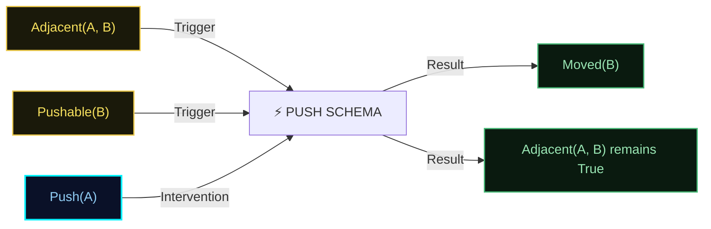

# Causal Structure Research Notes: Object-Oriented Causal Networks

**Earthos / Synapse Research Atlas**  
*Phase 38.5 Research Synthesis*

---

## 1. Context and Motivation
A key limitation of prior world-modeling approaches in Synapse was the lack of factorized causal understanding. In a monolithic world model, if the color of a block changes, the system must relearn the physics of pushing that block from scratch. 

To achieve true generalizability, future Synapse iterations must disentangle entities (objects) from the laws that govern them (causal schemas). These research notes outline how objects, relations, causes, and counterfactuals are structured in a schema-centric causal framework.

---

## 2. Causal Representation Model

### A. Objects (Entities)
Objects are not treated as fixed pixels or raw sensory vectors. Instead, they are represented as **bundles of features and affordances**:
$$\text{Object} = \langle \text{Identity}, \text{Attributes}, \text{Affordances} \rangle$$
*   **Attributes**: Latent properties (e.g., mass, velocity, temperature, color) represented as coordinates in local feature spaces.
*   **Affordances**: Action pathways supported by the object (e.g., `Pushable`, `Container`, `Obstacle`). Affordances are validated through interaction.

### B. Relations
Relations define the spatial, temporal, and functional connections between objects:
$$\text{Relation}(A, B) \rightarrow \{\text{Above}(A, B), \text{Connected}(A, B), \text{Part_Of}(A, B)\}$$
Causal dynamics often depend more on relations than individual object attributes. For example, pushing block $A$ only moves block $B$ if the relation `Adjacent(A, B)` is active.

### C. Causes and Effects (Schemas)
Causal relationships are represented as modular **Schemas**. A schema defines a deterministic or probabilistic causal transition:
$$\mathcal{S} = \{ \text{Conditions} \} \xrightarrow{\text{Action}} \{ \text{Effects} \}$$
*   **Conditions**: A set of object attributes and relations that must be true for the schema to apply.
*   **Action**: The action executed by the agent or an external force.
*   **Effects**: The resulting changes to attributes and relations.

### D. Interventions (Epistemic and Instrumental Actions)
The system distinguishes between observing a transition and performing an **Intervention** (Pearl's $do$-calculus):
*   **Observation**: Tracking passive state changes in the environment.
*   **Intervention ($do(A)$)**: Actively executing an action to modify the environment. Interventions allow the system to verify causal directions (e.g., does pushing $A$ cause $B$ to move, or does moving $B$ cause $A$ to move?).

### E. Counterfactuals
Counterfactual reasoning is the process of simulating alternative outcomes: *"What would have happened if I had executed action $A'$ instead of $A$?"*
1.  **Map Freezing**: Freeze the active latent cognitive map state.
2.  **Schema Rebinding**: Retrieve schemas that match the hypothetical conditions.
3.  **Hypothetical Rollout**: Execute the schemas in working memory to project the counterfactual trajectory. This allows the system to evaluate alternate paths and learn from mistakes without repeating them physically.
