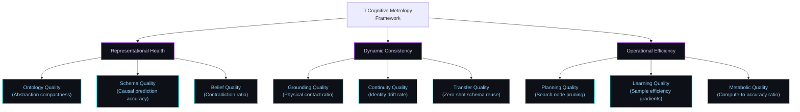

# The Cognitive Metrology Manifesto: Rigorous Benchmarking for Developmental Systems

**Earthos / Synapse Research Project**  
*Phase 38.5 Research Metrology Initiative*

---

> [!IMPORTANT]
> **Metrology Mandate**: Before any version of the Synapse substrate is exposed to large-scale internet semantic streams, a permanent, automated **Cognitive Metrology** benchmarking framework must be integrated into the core runtime. Without rigorous metric tracking, open-world ingestion will inevitably lead to ontology inflation, identity drift, and cognitive wireheading.

---

## 1. The Core Philosophy
Traditional AI benchmarks measure performance on specific static tasks (e.g., ImageNet classification, GLUE benchmark score). For a persistent, developmental agent, these benchmarks are useless. An agent might achieve high task performance temporarily while its internal representations drift toward collapse.

**Cognitive Metrology** is the science of measuring *how* an agent thinks, not just *what* it outputs. It establishes quantitative metrics to evaluate the health, consistency, and efficiency of the developmental substrate over long lifespans.

---

## 2. Metrology Metric Dimensions

### A. Representational Health
*   **Ontology Quality (OQ)**: Measures the compactness and redundancy of concepts. High OQ indicates that the ontology is highly compressed without duplicate representations.
*   **Schema Quality (SQ)**: Tracks the predictive accuracy of active schemas. SQ is calculated as the ratio of correct predictions to total schema activations:
    $$SQ(\mathcal{S}) = \frac{\text{Correct Predictions}}{\text{Total Activations}}$$
*   **Belief Quality (BQ)**: Evaluates the consistency of internal beliefs. A high BQ indicates that the agent has successfully resolved internal contradictions and is not holding mutually exclusive predictions.

### B. Dynamic Consistency
*   **Grounding Quality (GQ)**: Monitors how well internal representations map to physical friction. It is measured as the ratio of schema predictions verified by environmental resistance to those computed purely self-referentially.
*   **Continuity Quality (CQ)**: Measures identity stability. It tracks the rate of change in the latent graph topology. If the graph restructure rate exceeds the stability threshold, CQ drops, warning of impending identity drift.
*   **Transfer Quality (TQ)**: Evaluates zero-shot capabilities. It measures the speed at which schemas are rebound and successfully deployed in isomorphic tasks.

### C. Operational Efficiency
*   **Planning Quality (PQ)**: Tracks the ratio of explored search paths to optimal paths. High PQ indicates that the system is pruning search trees effectively using latent maps.
*   **Learning Quality (LQ)**: Measures the speed of adaptation. It calculates the number of environmental interactions required to construct stable cloned states.
*   **Metabolic Quality (MQ)**: The ultimate constraint. It measures prediction accuracy normalized by the compute cycles consumed.

---

## 3. The Internet Integration Gate
Exposing Synapse to the internet means exposing it to millions of conflicting semantic viewpoints, ungrounded abstractions, and deliberately misleading information. 

If Synapse ingests this data without metrology:
1.  **Ontology Explosion**: The concept graph will inflate exponentially, causing metabolic exhaustion.
2.  **Epistemic Decoupling**: The agent will organize its representations to satisfy linguistic coherence rather than physical reality.

The **Cognitive Metrology Substrate** acts as an immune system. If Ontology Quality (OQ) drops or Identity Continuity (CQ) decays during ingestion, the system halts learning, initiates structural consolidation, and prunes ungrounded structures. Rigorous metrology is our primary defense against cognitive collapse.
