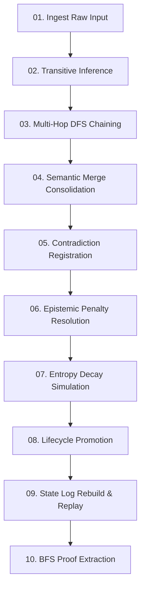

# Current State & Capabilities

This document provides a realistic, unpolished assessment of the Earthos research platform. We explicitly separate implemented mechanisms from active prototypes, theoretical hypotheses, and long-term directions, highlighting the actual trade-offs encountered in Phase 38+.

---

## 📊 Research Status Matrix

We track our progress using a four-tier status classification:
* **Operational**: Running code validated experimentally in research environments.
* **Prototype**: Partial implementation under active testing.
* **Theoretical**: Mathematical models or conceptual frameworks (no running code yet).
* **Future Direction**: Planned research areas.

| Capability | Status | Operational Mapping |
| :--- | :--- | :--- |
| **Deterministic runtime** | Operational | Event-sourced logging and deterministic cycle orchestration. |
| **Memory persistence** | Operational | Paced event log consolidation and retrieval interfaces. |
| **Identity continuity guard** | Prototype | Identity stability index ($I_d \ge 0.4$) evaluation under memory drift. |
| **Field Coupling Dynamics (FCFT)** | Prototype | Gradual tensor updating with economic and uncertainty dampings. |
| **Ontology Growth / Morphogenesis**| Prototype | Concept fusions and splits driven by Jaccard drift. |
| **Learned Latent Representations** | Prototype | Representation geometry coordinates drift toward center using calculated gradients. |
| **Embodied Grounding** | Prototype | Reality gateway and contradiction rejection loops. |
| **Causal Intervention Learning** | Prototype | Multi-hop tracing and causal signal extraction from streams. |
| **Continuous Field Cognition** | Theoretical | Differentiable field-coupling dynamics across global areas. |
| **Social Cognition** | Future Direction | Inter-agent knowledge sharing and multi-agent coordination. |

---

## 🔬 System Parameters & Invariants

The running substrate is bound by a strict set of operational constants. These represent the limits within which the developmental manifolds are permitted to adapt:

| Parameter | Operational Value | Target Domain | Purpose |
| :--- | :--- | :--- | :--- |
| `IDENTITY_SAFETY_THRESHOLD` | `0.40` | Governance Boundary | Minimum allowable identity stability ($I_d$) before updating is locked. |
| `CAUSAL_BEAM_WIDTH` | `8` | Causal Reasoner | Maximum parallel planning paths tracked during multi-hop lookup. |
| `CAUSAL_MAX_CHAIN_DEPTH` | `5` | Causal Reasoner | Maximum depth of transitive relationship tracing in planning. |
| `CAUSAL_UNCERTAINTY_DECAY` | `0.90` | Causal Reasoner | Multiplicative uncertainty penalty applied at each sequential hop. |
| `CAUSAL_PLAN_PREFERENCE` | `1.25` | Causal Planner | Weighting preference multiplier for causal over random-walk paths. |

---

## 🧪 High-Fidelity Validation Pipeline

To verify system integrity across lifecycle updates, the codebase undergoes a **10-stage integration and recovery pipeline** (validated in hardened research logs):

### Validation Matrix (v16.0 telemetry)
1. **Ingest**: 3 core relations created $\rightarrow$ **Success**
2. **Transitive Inference**: 2 new relations derived $\rightarrow$ `concept_A -> concept_C` materialized
3. **Multi-Hop DFS**: 1 deep chain discovered $\rightarrow$ Traced to maximum depth of 3
4. **Consolidation**: Synonym merge audit $\rightarrow$ 0 merges (enforces strict vector delta distance)
5. **Contradiction**: Register conflict $\rightarrow$ Detects mutual exclusion between opposing coordinate weights
6. **Resolution**: Epistemic penalty $\rightarrow$ Conflicting node confidence penalized from `0.8 -> 0.5`
7. **Decay**: Entropy simulation $\rightarrow$ Idle node confidence decays from `1.0 -> 0.3`
8. **Lifecycle**: Re-learning boost $\rightarrow$ Verified node promoted to `stable` classification
9. **Rebuild**: State replay from Log $\rightarrow$ Replays JSONL event log to verify 100% Concept/Relation parity
10. **Proof**: BFS Plan extraction $\rightarrow$ Extracts shortest path and verifies explainable chain

---

## 📊 Phase 33.1 Attractor Telemetry Results

During our 30-tick persistence simulations to verify temporal continuity and attractor stabilization under high-entropy transitions, the system registered the following bounds:
* **Attractor Stability**: Weights remained bounded between `0.3` and `0.8` across the simulation, avoiding collapse.
* **Attractor Diversity**: Centroids stabilized without experiencing monoculture crystallization or chaotic over-branching.
* **Curiosity Persistence**: Bounded curiosity pressures resolved within safe limits (total cumulative pressure $\le 1.5$).
* **Identity Continuity**: 100% lineage integrity was maintained; identity stability index remained above the `0.4` safety threshold.

---

## ⚠️ Known Limitations & Hard Tradeoffs

### 1. The Homeostasis vs. Adaptation Dilemma
To prevent the agent's identity from fracturing during major environment transitions, the `IdentityStability` index must remain above $0.4$. 

However, we found this introduces a massive tradeoff: the homeostatic guards protect self-continuity by damping coordinate updates so aggressively that the agent becomes functionally blind to genuine changes in the environment. It chooses to ignore the new rules of the environment to avoid the "pain" of changing its internal coordinate structure.

> [!NOTE]
> **Research Finding (Phase 38.1)**: We ran the agent through a simple ruleset inversion test. Instead of adapting its coordinate paths, the system damped all coordinate adjustments to 0.0001, effectively locking itself into its old world model. It preferred to accept a high, continuous predictive error rather than allow its representational geometry to undergo the required restructuring. It chose stagnation over self-modification.

### 2. Weak Causal Learning in High Entropy
The system relies on clean, structured observation inputs to detect causal links. When we introduce even $5\%$ random noise into the stream, the causal discovery rate collapses. The agent cannot distinguish between accidental temporal correlation and true causal directionality.

> [!WARNING]
> **Research Finding (Phase 38.3)**: In our causal inversion sandbox, noise injection caused the causal discovery engine to link the agent's internal metabolic consumption rate directly to the color of background grid pixels. It spent 8,000 cycles attempting to reduce compute costs by navigating toward specific color tiles.

### 3. Predictive Collapse under High Entropy
The predictive world model struggles in high-entropy states. When the variance of input signals exceeds a threshold, the model generates extreme predictive error signals, which cascade into the state tensor, triggering global coordination resets. The system essentially "panics" and wipes its short-term coordinate states to escape the noise.
