# Dataflows and Execution Workflows (Phase 31.3)

This document describes the active inference, open-world learning, and pressure-driven structural reorganization workflows in the Synapse Arch substrate.

---

## 🗺️ Open-World Learning Pipeline

External streams pass through validation and filtering stages before updates are consolidated into long-term memory:

```mermaid
graph TD
    Stream[External Stream Input] -->|1. Paced Ingestion| Gateway[RealityStreamGateway]
    Gateway -->|2. Audits Contradictions| Grounding[TruthGroundingEngine]
    Gateway -->|3. Audits Loops & Ideology| Toxicity[InformationToxicityMonitor]
    
    Grounding -->|4. Stable Patterns| Extractor[CausalSignalExtractor]
    Toxicity -->|4. Safe Signals| Extractor
    
    Extractor -->|5. Write Events| EventLog[Event Log Ledger]
    EventLog -->|6. Compile Snapshots| Memory[PersistentRealityMemory]
    
    style Stream fill:#1a1d24,stroke:#4a5568,stroke-width:1px;
    style Gateway fill:#111317,stroke:#00f2fe,stroke-width:1px;
    style Grounding fill:#111317,stroke:#9d4edd,stroke-width:2px;
    style Toxicity fill:#111317,stroke:#9d4edd,stroke-width:2px;
    style Extractor fill:#111317,stroke:#0070f3,stroke-width:1px;
    style EventLog fill:#111317,stroke:#00f2fe,stroke-width:1px;
    style Memory fill:#1a1d24,stroke:#00f2fe,stroke-width:2px;
```

---

## ⚙️ Pressure-Driven Reorganization Loop

The `UnifiedCognitivePressureRuntime` monitors cognitive tension to trigger self-organizing structural updates:

### Phase 1: Real-time Pressure Monitoring
* The `DevelopmentalRecursivePressureField` continuously monitors:
  * **Concept Instability** (frequent changes in short-term structures).
  * **Prediction Tension** (difference between forecast outcomes and observations).
  * **Transfer Mismatch** (failure to generalise skills across domains).
  * **Simulation Inefficiency** (computational overhead during counterfactual rollouts).
  * **Ecological Stress** (resource scarcity under metabolic limits).

### Phase 2: Directive Generation
* If total pressure exceeds the baseline threshold, the pressure field emits reorganization directives:
  * **Concept Fusion**: Merging redundant or close concepts in latent space (compaction) to resolve simulation inefficiency.
  * **Concept Split**: Dividing overloaded concepts undergoing high semantic drift (differentiation) to resolve prediction tension.

### Phase 3: Energy Capping & Safety Auditing
* **Oscillation Guard**: Excludes conflicting operations (e.g. splitting and fusing the same concepts in the same tick).
* **Identity Continuity Field**: Verifies that the proposed reorganization does not degrade identity stability below the safety threshold ($I_d \ge 0.4$).
* If safety checks pass, the mutations are written to the Event Log Ledger and applied to the persistent substrate.
