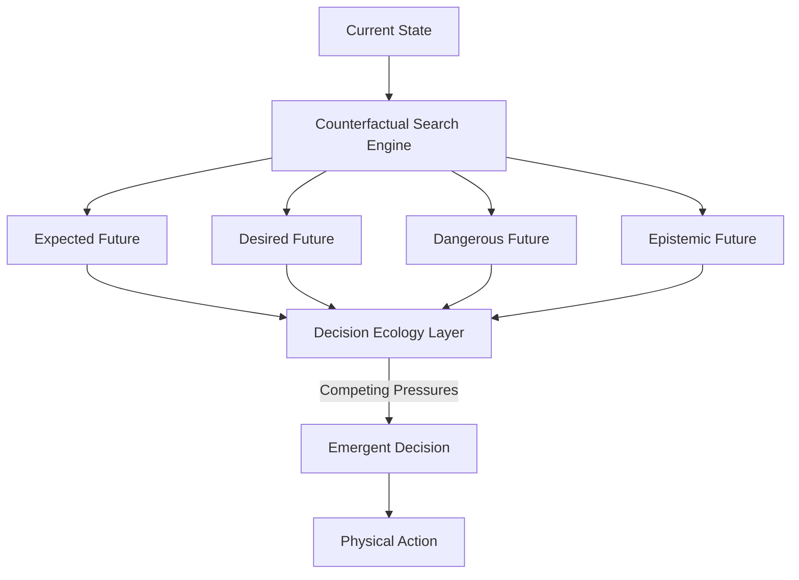

# Decision Ecology & Counterfactual Search: Multi-Pressure Action Selection

**Earthos / Synapse Research Atlas**  
*Phase 38.5 Architectural Foundations — Established by Architecture Migration 07*

---

## 1. Introduction & Scientific Motivation
Traditional reinforcement learning and model-based AI architectures represent planning as a direct mathematical optimization:
$$\text{Goal} \rightarrow \text{Optimizer} \rightarrow \text{Action}$$
This paradigm works exceptionally well in closed environments (e.g., chess, static environments) but suffers from cognitive rigidity and catastrophic failure when confronted with real-world uncertainty, incomplete information, and contradictory evidence.

The Synapse architecture reframes this paradigm: **Planning is future comparison; action emerges from future competition.**
Instead of calculating a single "optimal" trajectory, the agent continuously generates multiple imagined, alternative (counterfactual) futures in working memory. These futures compete under a multi-pressure **Decision Ecology**, and the physical action taken is the emergent consequence of this competition.

This structural approach draws scientific inspiration from:
- **Active Inference**: Actions are selected to minimize expected variational free energy, balancing physical target achievement (instrumental value) with map-uncertainty reduction (epistemic value).
- **World Models**: Ha & Schmidhuber's paradigm is extended from direct prediction to multi-scenario future simulation.
- **Cognitive Science**: The human capacity for vicarious trial-and-error—simulating potential conversations, actions, and failures in working memory prior to physical execution.

---

## 2. Core Architecture: The Counterfactual Search Engine (CSE)

The **Counterfactual Search Engine (CSE)** is the operational component responsible for projecting candidate futures.

### A. Engine Specifications
- **Inputs**:
  - *World Models*: Generates forward-projected state trajectories.
  - *Belief Ecology*: Provides confidence bounds and alternative explanations.
  - *Goal Pressure*: Current active task and target profiles.
  - *Current Context*: Gated subsets of active memory.
  - *Active Schemas*: Factorized action templates available for binding.
- **Outputs**:
  - *Future Candidates*: Simulates branching trajectories.
  - *Outcome Estimates*: Quantifies physical impact.
  - *Risk Estimates*: Detects potential catastrophic failures.
  - *Uncertainty Estimates*: Maps regions of predicted map ignorance.

### B. Future Generation Profiles
Rather than predicting a single path, the CSE generates a spectrum of branching scenarios:
1. **Expected Futures**: The most likely outcomes under standard transition probabilities.
2. **Desired Futures**: Scenarios that maximize goal achievement.
3. **Dangerous Futures**: Critical failure modes and worst-case outcomes (used to compute risk boundaries).
4. **Novel/Epistemic Futures**: Paths that prioritize exploring highly uncertain coordinates to acquire map information.
5. **Contradictory Futures**: Alternative scenarios designed to test competing hypotheses under belief disagreement.

---

## 3. The Decision Ecology Layer

Once the CSE projects candidate futures, they enter the **Decision Ecology Layer** to compete for execution control.

### A. Competing Pressures (The Decision Pressure Model)
Action selection emerges from balancing five coexisting, coupled computational pressures:
- **Goal Pressure**: The drive to achieve physical objectives (success potential).
- **Knowledge Pressure**: The epistemic drive to reduce variational free energy by resolving map uncertainty.
- **Risk Pressure**: The drive to avoid dangerous, irreversible, or high-cost states.
- **Curiosity Pressure**: The intrinsic drive to explore novel transitions, absorbing the standalone curiosity engines of Migration 06.
- **Resource/Metabolic Pressure**: The compute and energy budget constraints restricting path complexity.

### B. Scoring Invariants
Every future candidate $F$ is scored along five metrics:
1. **Plausibility**: Does the scenario violate map topology or active belief constraints?
2. **Utility**: How effectively does the future satisfy target goal profiles?
3. **Reversibility**: Can the system recover if the physical rollout fails?
4. **Information Gain**: Will executing this sequence validate or invalidate high-priority schemas?
5. **Context Alignment**: Does the sequence fit active gating restrictions?

---

## 4. Subsystem Integration
The Decision Ecology acts as the junction point for representational and predictive layers:
- **Cognitive Maps**: Provide the structural graph topology (relational transition scaffolding) over which the search is conducted.
- **Schemas**: Provide modular, factorized action templates that serve as the stepping-stones of counterfactual paths.
- **Belief Ecology**: Evaluates the probability and confidence scores of branching states.
- **Actuators**: Execute the physical commands selected by the winning future.

---

## 5. Architectural Failure Modes & Safeguards

The Decision Ecology must balance exploration and safety to avoid key cognitive failure modes:
* **Analysis Paralysis**: Exploding counterfactual branches freeze decision making.
  - *Safeguard*: Enforce a strict metabolic compute budget on search depth and node branching.
* **Impulsive Planning**: Insufficient future simulation leading to low-accuracy, high-risk actions.
  - *Safeguard*: Require mandatory search rollouts for any action sequence that crosses a high-uncertainty state.
* **Catastrophic Optimism**: Focusing purely on desired futures while ignoring dangerous scenarios.
  - *Safeguard*: Hardcode risk-monitoring threads that inject negative-gradient overrides when a dangerous future's probability exceeds a safety threshold.
* **Planning Hallucination**: Generating highly elaborate future chains that depend on ungrounded or contradicted schemas.
  - *Safeguard*: Scale future scores by the confidence weights of their underlying schemas in the Belief Ecology.
