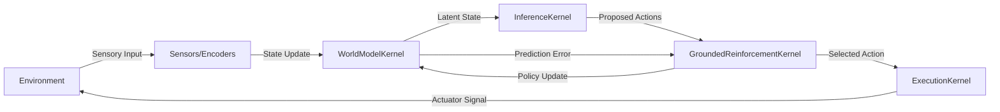

# Embodied Cognition

Synapse Arch is built on the principle of **Embodiment**: intelligence is not a disembodied manipulation of symbols, but a process deeply coupled to an agent's physical (or simulated) presence in an environment.

## 🔄 The Sensorimotor Loop

Cognition in Synapse Arch follows a continuous loop of sensing, predicting, acting, and learning. This loop is the primary driver of competence scaling.

## 🌍 Reality Grounding

"Reality" in Synapse Arch serves as the ultimate arbiter of truth. While internal reasoning may generate elegant hypotheses, the `GroundedReinforcementKernel` and `GovernanceKernel` ensure that these hypotheses are constantly tested against sensory feedback.

### Key Concepts
-   **Active Inference**: The agent doesn't just react to the world; it acts to gather information and reduce its uncertainty about its environment.
-   **Proprioception**: The system maintains an internal model of its own cognitive and "physical" state, allowing it to reason about its own capabilities and limitations.
-   **Persistence**: Unlike episodic RL, where the agent starts fresh in every trial, Synapse Arch persists. If it damages its "body" or its environment, that damage remains, forcing the agent to learn survival-oriented behaviors.

## 📡 Sensory Multimodality

The architecture supports a diverse array of sensory inputs, processed by adapters that feed into the `WorldModelKernel`:
-   **Visual**: Neural encoders for pixel-level or object-level representation.
-   **Proprioceptive**: Internal state feedback (battery levels, joint angles, compute budget).
-   **Thermal/Tactile**: Simulated or real-world haptic data.
-   **Temporal**: High-resolution timing data for causal modeling.

## ⚖️ The Cost of Action

Every action in the environment has a cost—not just in terms of environment energy, but in terms of **Cognitive Economics**. Deciding what to do next requires the `InferenceKernel` to balance the potential reward of an action against the compute cost of simulating its outcomes.
