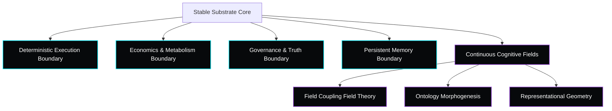

# The Earthos Manifesto: Stable Substrates & Developmental Cognition

> [!IMPORTANT]
> **Core Research Disclaimer**: Earthos is not claiming to have solved AGI. The current codebase is an evolving developmental cognition research platform exploring persistent, embodied, adaptive intelligence under real-world, computational, and ecological constraints. It is an active research program, not a commercial product or a proven cognitive architecture.

---

## 🏛️ What Earthos Is NOT

To prevent the common narrative drift of modern AI hype, Earthos is explicitly defined by what it refuses to be:
* **NOT a chatbot framework**: We do not build conversational assistants or optimize for polite, chat-centric dialogue flow.
* **NOT an LLM wrapper**: We do not build scripting layers designed to chain calls to static commercial APIs.
* **NOT an autonomous AGI claim**: We do not claim to have built a general intelligence. It is an experimental sandbox to investigate developmental dynamics.
* **NOT a production-ready system**: This is a frontier research platform with known failure modes, designed to document engineering scars, tradeoffs, and correction loops.

---

## 🧬 Core Vision: Exploring a Different Branch

The modern artificial intelligence paradigm has converged into an intellectual monoculture. Ever-larger static transformers are trained on disembodied web text to predict the next token. These systems are stateless, disembodied, and computationally infinite from their own perspective.

We are traveling on a different branch:

Earthos shifts the research focus from parameter scaling to **competence scaling** within a bounded developmental cognition framework. We investigate how stable execution constraints force the emergence of robust, adaptive world models.

---

## ⚙️ Foundational Pillars

### 1. Bounded Substrate Architecture
Rather than engineering complex, shifting cognitive organs, we define a frozen execution boundary. The core codebase (handling logging, memory serialization, resource consumption, and telemetry clocks) is locked. All cognitive complexity, task adaptation, and conceptual abstractions must emerge dynamically within the continuous coordinate fields, preventing codebase bloat.

### 2. Persistent Identity Continuity
The system does not undergo epoch resets or environment wipes. experiences, memory index associations, and network coordinate mutations persist across the entire lifecycle of the agent. The core problem is to maintain selfhood coherence (Identity Stability $I_d \ge 0.4$) under constant, real-time sensory inputs.

### 3. Open-World Grounding
Internal representations are not validated by logical self-consistency or syntactic beauty. They are experimentally validated against environmental friction. When the agent's internal predictions clash with sensory feedback, the system does not silently adjust its weights—it generates localized developmental tension ($P_d$) that forces structural coordinate updates.

### 4. Bounded Cognitive Metabolism
No compute is assumed free. Every cycle spent on counterfactual simulation, path planning, and memory consolidation incurs an explicit metabolic cost in the homeostatic engine. The agent must choose between spending resources to plan or conserving energy to survive, forcing the emergence of abstraction pruning.

---

## ⚖️ Paradigmatic Comparison

| Architectural Dimension | Episodic LLM Agents | Earthos Developmental Substrates |
| :--- | :--- | :--- |
| **Persistence Horizon** | Stateless. Wiped after each chat window context limit. | Lifecycle-long persistence of weights, memory indexes, and coordinates. |
| **Metabolic Budgeting** | Assumed infinite. Every API call or token generation is free to the agent. | Explicit metabolic caps. Compute overhead incurs homeostatic penalties. |
| **Representational State** | Static token embeddings and fixed pre-trained parameters. | Continuous coordinate drift in `AdaptiveRepresentationalGeometry`. |
| **Adaptation Trigger** | Offline gradient descent on offline datasets. | Real-time coordinate mutation driven by Cognitive Free Energy ($F_c$) gradients. |
| **Self-Auditing** | External alignment checks and system prompt instructions. | Deterministic `TruthGrounding` audits checking for contradiction loop lock-ins. |
| **Ontological Growth** | Static vocabulary size. | Dynamic node fusion and splitting driven by Jaccard drift under pressure. |

---

## 🔬 The Research Method: Humility & Postmortems

We believe the path to general intelligence requires documenting engineering failures, rather than polishing public narratives. We structure our development around:

1. **Tradeoff Transparency**: Documenting why systems fail (such as the homeostasis vs. adaptation dilemma, where identity guards prevent the agent from learning new environments).
2. **Failure Analysis**: Actively sharing postmortems on structural problems (such as monitor bureaucracy, ontology inflation, and synchronization monoculture attractors).
3. **Correction Verification**: Verifying code changes against continuous noise-injected control environments, rather than static language puzzles.

Our target is not to build a system that appears intelligent, but to understand the fundamental laws of persistent, bounded, adaptive cognition.
