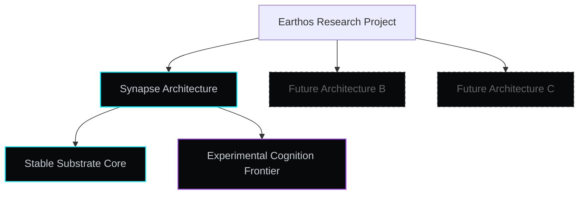

# The Earthos Manifesto

> [!IMPORTANT]
> **Research Disclaimer**: Earthos is not claiming to have solved AGI. The current platform is an evolving developmental cognition research project exploring persistent, embodied, adaptive intelligence under real-world, computational, and ecological constraints. It is an active research project, not a commercial product or a proven cognitive architecture.

---

## What Earthos Is NOT

To prevent narrative drift into the kind of hype that makes AI research harder to take seriously, Earthos is explicitly defined by what it refuses to be:

- **NOT a chatbot framework** — we do not build conversational assistants or optimize for polite dialogue flow.
- **NOT an LLM wrapper** — we do not build scripting layers designed to chain calls to commercial APIs.
- **NOT an AGI claim** — we do not claim to have built general intelligence. We are investigating the conditions under which developmental cognition might scale.
- **NOT a production-ready system** — this is a frontier research platform with documented failure modes. Its purpose is to generate honest research findings, not deployable software.

---

## Core Vision: A Different Branch

The modern AI paradigm has converged into an intellectual monoculture. Ever-larger static models are trained on disembodied text to predict the next token. These systems are stateless — they have no history, no consequences, no metabolic costs. Each interaction is an isolated performance.

We are investigating what happens when you take those assumptions away.

Earthos shifts the research focus from **parameter scaling** to **competence scaling under ecological constraint** — investigating how intelligence develops when an agent must survive, adapt, and maintain coherent identity over time.

---

## Foundational Pillars

### 1. Bounded Substrate Architecture

We maintain a small, frozen stable core and allow all cognitive complexity to emerge within self-organizing experimental fields layered above it. The stable core never adapts. The experimental frontier reorganizes continuously. This separation is what makes the system scientifically meaningful — without a stable reference frame, it is impossible to measure developmental change.

### 2. Persistent Identity Continuity

The system does not undergo epoch resets or environment wipes. Experiences, memory associations, and representational updates persist across the entire lifecycle. The core research problem is maintaining coherent selfhood under continuous, real-time environmental pressure — not just within a single session, but across developmental time.

### 3. Open-World Grounding

Internal representations are not validated by logical self-consistency or linguistic coherence. They are tested against environmental friction. When the system's predictions clash with sensory feedback, that friction generates developmental tension that forces representational restructuring.

Grounding is not a module. It is a continuous pressure.

### 4. Bounded Cognitive Metabolism

No compute is assumed free. Every cognitive operation — simulation, planning, memory consolidation, representational restructuring — has a metabolic cost. The system must choose between spending resources to plan and conserving them to survive. This constraint forces the emergence of efficient, well-structured cognition rather than unchecked abstraction growth.

---

## Paradigmatic Comparison

| Dimension | Episodic LLM Agents | Earthos Developmental Architecture |
|---|---|---|
| **Persistence** | Stateless; wiped after each session | Lifecycle-long continuity of memory and representational structure |
| **Metabolic Model** | Compute costs ignored by the agent | Explicit metabolic constraints drive all cognitive decisions |
| **Representation** | Static embeddings from frozen training | Continuous representational geometry that restructures under developmental pressure |
| **Adaptation** | Offline gradient descent against static datasets | Real-time restructuring driven by environmental friction |
| **Self-Auditing** | External alignment and prompt engineering | Active internal grounding that tests predictions against physical consequence |
| **Ontological Growth** | Fixed vocabulary determined at training | Dynamic concept ecology that grows, consolidates, and prunes under developmental pressure |

---

## The Research Method: Humility Over Hype

We believe the path toward general intelligence requires documenting failures honestly rather than polishing public narratives. Our development is structured around:

1. **Tradeoff transparency** — documenting why systems fail (the homeostasis vs. adaptation dilemma, the false affordance problem, causal learning under noise).
2. **Failure analysis** — actively sharing postmortems on structural problems: monitor bureaucracy, symbolic theater, synchronization monocultures.
3. **Reality-grounded verification** — testing against adversarial noise-injected environments rather than static benchmarks.

Our target is not a system that appears intelligent. It is a program that generates honest findings about what persistent, bounded, developmentally-grounded cognition actually requires.

---

> [!NOTE]
> Certain operational details, runtime structures, and experimental implementation mechanics are intentionally omitted from public documentation to preserve research integrity while maintaining conceptual transparency. The documentation describes what the architecture attempts to achieve and where it currently fails — not how it is implemented.
