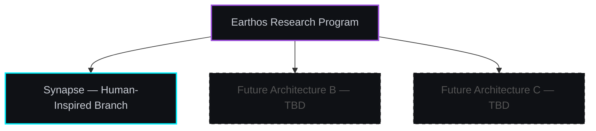

# Research Philosophy: The Earthos Project & Synapse Architecture

---

## What Earthos Is

Earthos is a long-horizon research program dedicated to exploring developmental cognition — intelligence that grows, adapts, and maintains structural continuity over time under ecological constraint.

It is not a product. It is not a claim. It is an active research commitment.

The program is deliberately structured as an open-ended investigation. If the current architectural approach reaches fundamental limits, Earthos will explore alternative architectures. Synapse is the first branch, not the final answer.

---

## What Synapse Is

**Synapse** is the name of the primary architecture currently under development within Earthos. It is a human-inspired cognitive substrate — meaning it draws structural and functional inspiration from biological cognition, not because biology is the only valid template, but because biological intelligence is the only proven example of general-purpose developmental cognition we have.

Synapse is not a simulation of a brain. It is an architecture that borrows functional principles — persistent memory, metabolic constraint, prediction-error-driven adaptation, embodied grounding — and implements them in computational form under the constraints of a real research environment with limited resources.

---

## The Core Critique

The current AI landscape is dominated by scaling static transformers — models trained offline against fixed datasets to predict the next token. These systems have achieved remarkable capability within their domain, but they share a structural limitation: they are stateless, disembodied, and computationally unconstrained from their own perspective.

They cannot remember. They cannot develop. They cannot survive.

Earthos rejects this as the only research direction worth pursuing. We assert that **general intelligence is a survival strategy** — something that emerges from an organism that persists through time, operates under real constraints, and must maintain coherent structure while continuously adapting to an environment that doesn't care whether it succeeds.

This is a research bet. We are not certain it is correct. We are investigating whether it is.

---

## The Research Posture

Earthos takes the position that:

**Failure is data.** The most useful information comes from carefully-documented failures, not polished capability demonstrations. Our research philosophy is structured around postmortems, tradeoff transparency, and honest assessment of what the architecture cannot yet do.

**Authenticity over appearance.** We are more interested in understanding what developmental cognition actually requires than in building systems that appear intelligent under favorable conditions.

**Long horizons matter.** Research that produces genuine insight on timescales of years is more valuable than impressive demonstrations that do not generalize. We are building for the long run.

**Ecological grounding is the hard part.** Internal symbolic consistency is easy. Maintaining grounded representations that track environmental reality over developmental time — under noise, contradiction, and continuous change — is the actual problem.

---

## High-Conviction Research Bets

Earthos is explicitly structured to pursue research directions that typical commercial AI labs cannot prioritize:

- **Substrate independence**: Building developmental cognition that does not depend on the continued availability of commercial API providers.
- **Genuine persistence**: Investigating what happens when an agent cannot reset — when consequences accumulate and history cannot be discarded.
- **Ecological constraint as a feature**: Treating metabolic and resource limits not as engineering problems to be solved, but as the developmental pressure that forces the emergence of efficient, structured cognition.

These are not guaranteed to work. They are commitments to an approach we believe is underexplored and potentially important.

> [!NOTE]
> Certain operational details, runtime structures, and experimental implementation mechanics are intentionally omitted from public documentation. The research philosophy, architectural orientation, and honest failure record are public. The implementation is not.
