# Research Philosophy: The Earthos Project & Synapse Architecture

Earthos is a long-horizon research project dedicated to building sovereign, persistent systems. Within this project, **Synapse** is the name of the primary architecture currently being developed. 

Synapse is not a complete or final project in itself; it is the name of our initial architecture designed around a human-inspired path toward AGI. Because we are committed to open-ended cognitive research, the Earthos project will explore other alternative architectures and developmental attempts in the future.

```mermaid
graph TD
    A[Earthos Project: Sovereign Cognitive Research] --> B[Synapse Architecture: Human-Inspired Substrate]
    A --> C[Future Architecture B: Alternate Embodiment Stack]
    A --> D[Future Architecture C: Latent World Model Arena]
    
    style A fill:#1a1d24,stroke:#9d4edd,stroke-width:2px;
    style B fill:#111317,stroke:#00f2fe,stroke-width:2px;
    style C fill:#111317,stroke:#4a5568,stroke-width:1px,stroke-dasharray: 5 5;
    style D fill:#111317,stroke:#4a5568,stroke-width:1px,stroke-dasharray: 5 5;
```

---

## 🧱 The Core Critique of Next-Token Prediction

The current AI landscape is dominated by scaling static, episodic transformers. These systems are stateless, disembodied, and optimized to minimize surprise over next-token predictions in static datasets. 

Earthos rejects this monoculture. We assert that general intelligence is a **survival strategy** that can only emerge from an active, persistent organism interacting with an environment under metabolic and structural constraints.

| Dimension | Episodic LLMs | Synapse Architecture (under Earthos) |
| :--- | :--- | :--- |
| **Persistence** | Stateless windows; context resets every session. | Permanent, stateful history; memory and weights persist continuously. |
| **Learning** | Frozen weights (outside expensive fine-tuning). | Continuous local adaptation and paradigm evolution. |
| **Objective** | Minimize token cross-entropy surprise. | Minimize prediction error against reality (Active Inference). |
| **Presence** | Disembodied text processors. | Embodied sensorimotor agents. |
| **Resource constraint** | Invariant to execution costs (handled by API/provider). | Explicit cognitive economics (budgets planning and simulation energy). |

---

## 🧬 Embodied Predictive Intelligence

Our methodology centers on **Active Inference** and **Predictive World Modeling**. 

### 1. Causal World Modeling
Rather than memorizing patterns, the agent builds a dynamic model of environmental dynamics. This model is constantly tested through actions, forcing the emergence of latent causal schemas.

### 2. Epistemic Action
Action is not simply an output vector; it is a mechanism for gathering information. The agent takes actions to resolve uncertainty, test hypotheses, and gather data, negotiating its reality continuously.

---

## 🏛️ High-Conviction Risk Taking

Earthos is explicitly designed to take risks that typical VC-backed startups and academic labs cannot. 

1. **API/Model Independence**: Synapse is designed to build a sovereign substrate, reducing reliance on third-party API providers.
2. **Cognitive Metabolism**: We treat compute as a limited resource, forcing the system to optimize its focus, pruning useless abstractions to survive.
3. **No Magic Abstractions**: Every layer must map directly to the deterministic event ledger.
