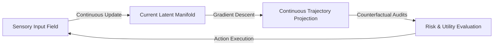

# World Modeling & Continuous Latent Forecasting

The world modeling layer of Synapse is the predictive theater of the architecture. It is responsible for building, maintaining, and projecting latent representations of environmental dynamics, allowing the system to run continuous counterfactual simulations and evaluate risk curves before executing physical actions.

---

## 🏛️ Evolution of World Modeling: From Symbols to Latent Fields

The world model was originally built as a step-wise symbolic counterfactual predictor. Its development is marked by severe empirical failures that forced a shift toward continuous latent dynamics:

### 1. The Causal Inversion & Pixel Color Struggle (Phase 38.3)
Early causal learning models relied on clean, structured observation inputs. When we introduced $5\%$ random noise into the sensor streams, the causal discovery engine collapsed. The system struggled to separate accidental correlations from causal vectors, leading the model to link the agent's internal metabolic consumption rate directly to the color of background grid pixels. It spent 8,000 cycles attempting to reduce compute costs by navigating toward specific color tiles.
* **The Decision**: We replaced flat correlation metrics with a robust **Directed Graph Projection** system. Causal links are now projected into a directed graph and filtered by strict confidence bounds. We also implemented a decayed multi-step credit attribution system to isolate and penalize failing links.

### 2. The False Affordance Struggle (Phase 37.5)
In noiseless synthetic testing, the world model performed perfectly. However, when we introduced continuous sensor noise, the grounding layer began stabilizing false affordances—hallucinated paths that the system believed existed because a temporary sensor drop matched its internal prediction. The agent stabilized a "phantom wall" affordance due to three consecutive dropped frames in a simulated sensor array. It spent the next 4,000 cycles navigating around a wall that did not exist, ignoring direct physical coordinates showing the space was empty.
* **The Decision**: We added active contradiction testing to the grounding module. When the system detects a mismatch between predicted path clearances and physical collision events, it triggers an immediate coordinates reset on the affected region. Real-world physical feedback must override internal world model expectations, always.

---

## 🌀 Continuous Latent Forecasting

Rather than executing discrete, step-wise symbolic transitions, the world model operates as an asynchronous, continuous-time field simulator. It projects continuous trajectories through representation space that interact directly with active sensory coordinate fields:

### Key Dynamics
* **Trajectory Projection**: Evaluates how belief coordinates evolve along continuous paths, identifying unstable transition states and prospective bottlenecks.
* **Asynchronous Integration**: Feeds raw sensorimotor and information streams directly into the active simulation layers without pausing execution ticks, maintaining real-time alignment.

---

## 🔒 Dynamic Causal Belief Ecologies (Phase 39)

Transitioning from static, closed environments to internet-scale real-world learning requires the world model to manage unstable, contradictory information streams:

### 1. Probabilistic Coordinate Mapping
Beliefs are represented as temporally-weighted coordinate clouds rather than rigid binary symbols. Every representation maintains:
* **Uncertainty Mass**: The variance of the forecast model around that concept's coordinates.
* **Causal Directionality**: Extracted dependencies that separate correlation from true causal vectors under noisy conditions.

### 2. Epistemic Action Verification
To combat large-scale symbolic drift and misinformation, the world model plans exploratory actions (interventions) designed to test its own hypotheses. By checking whether a targeted perturbation produces the simulated outcome, the system actively validates its representations against environmental resistance.

### 3. Contradiction-Sensitive Restructuring
When the world model encounters incoming information that contradicts high-confidence schemas:
* It flags a local contradiction spike.
* It routes attentional resources to the conflicting coordinates.
* It runs counterfactual rehearsals overnight to restructure the local topology, integrating the new evidence without destabilizing global identity continuity.
