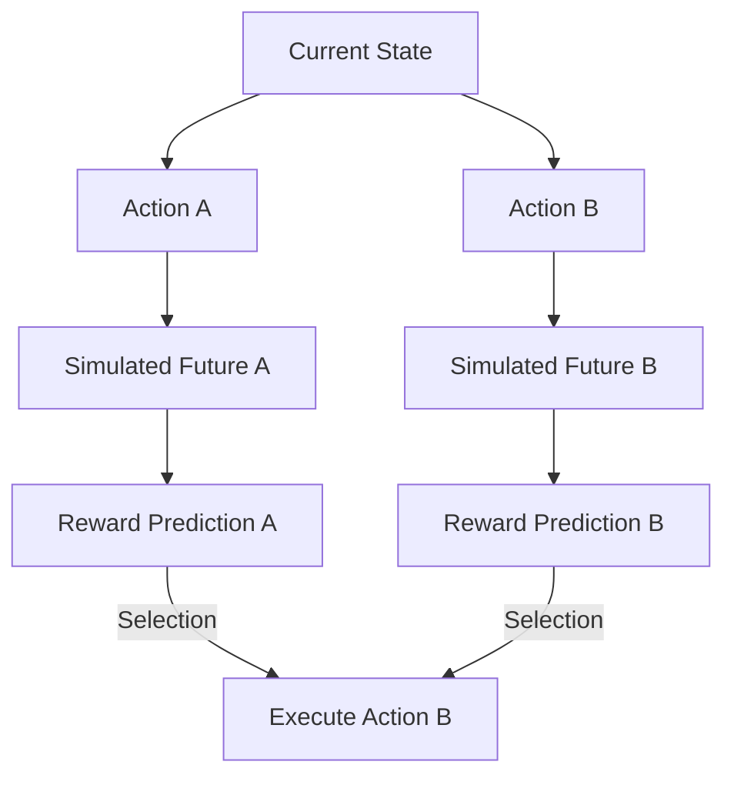

# World Modeling & Predictive Processing

The `WorldModelKernel` is the "theater" where Synapse Arch simulates the future. It is responsible for building and maintaining a latent representation of the environment's dynamics, allowing the agent to plan and reason without risking immediate action.

## 🔮 Predictive Self-Supervision

In Synapse Arch, the primary learning signal is not external reward, but **Prediction Error**. The system constantly predicts the next sensory frame based on its current state and action. The difference between the prediction and the actual sensory outcome is used to refine the world model.

### The Prediction Loop
1.  **Forecast**: Given state $S_t$ and action $A_t$, predict $S_{t+1}$.
2.  **Act**: Perform action $A_t$ in the environment.
3.  **Observe**: Sense actual state $S'_{t+1}$.
4.  **Correct**: Minimize $||S_{t+1} - S'_{t+1}||$ by updating the world model parameters.

## 📽️ Counterfactual Rollouts (Imagination)

Because the `WorldModelKernel` can simulate transitions, the `InferenceKernel` can perform "mental experiments."

### Capabilities
-   **Planning**: Searching for action sequences that lead to high-utility future states.
-   **Safety**: Identifying dangerous outcomes *before* they occur in reality.
-   **Curiosity**: Actively seeking out states where the world model's prediction error is high, driving exploration and learning.

## 🌫️ Latent State Representations

While early versions of Synapse Arch relied on symbolic graph nodes, our current research focuses on **Learned Latent Spaces**. Instead of mapping the world to human-readable symbols, the world model learns a compressed, high-dimensional representation that captures the essential causal dynamics of the environment.

### Benefits of Latent Modeling
-   **Generalization**: Similar environmental configurations map to similar points in latent space.
-   **Computational Efficiency**: Predicting transitions in a compressed latent space is much faster than predicting raw sensory data.
-   **Abstract Reasoning**: Relations between latent concepts can emerge naturally through interaction, rather than being handcrafted.
